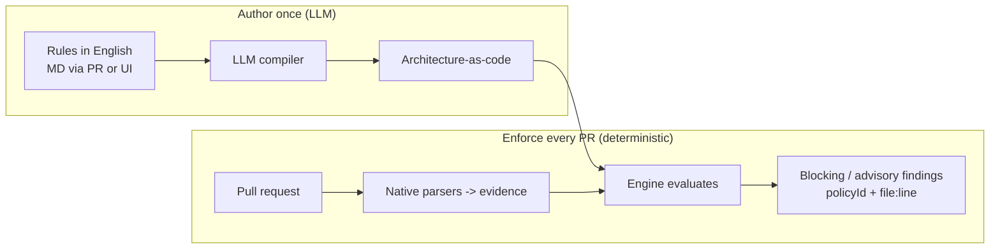

# ArchGuard-AI

**Continuous architecture review at every step — not once.**

Write your architecture rules in **plain English**. An LLM turns them into automated
**architectural fitness functions** — deterministic checks that run on every pull request.
No DSL to learn, no rules rotting in a wiki.

**Define → Automate → Enforce**

1. **Define** — an architect writes a rule in natural language (org / domain / team /
   service, HLD + LLD), via a Markdown PR or the UI. Easy: no special syntax.
2. **Automate** — an LLM compiles each rule into an architectural **fitness function**
   (architecture-as-code) once, at authoring time.
3. **Enforce** — the pipeline runs those fitness functions deterministically on every PR
   and blocks high-confidence drift, with a policy ID and `file:line` for every finding.

> The model proposes at authoring time. The fitness function decides at runtime.

## The problem

Architecture review today is a **point-in-time event, not a continuous practice** — and it
hurts **both sides** of the team every day:

- **The developer** must ship fast but doesn't hold the whole architecture in their head, so
  they cross a boundary without knowing it existed.
- **The architect** has no lever except email — nudging teams rule by rule, thread by thread.
  Governance by reminder doesn't scale.

It also breaks down in three structural ways:

- **Reviewed once, then it drifts.** Architecture is signed off at project kickoff and
  maybe revisited at an ARB every six months. Between those checkpoints the code drifts
  from the intended design, and nobody notices until it is expensive to unwind.
- **Rules are hard to enforce because they are hard to update.** Governance lives in
  wikis, slide decks, and senior engineers' heads. Because there is no easy way to change
  them, they go stale, contradict each other, and get ignored.
- **Developers can't follow what they can't see.** Guidance is verbal and tribal, never
  expressed as **architecture-as-code**. There is no automated check on a PR, so
  violations are caught late in a manual review — if at all.

**The gap:** architecture intent is never turned into an executable, always-on check that
runs where developers actually work — the pull request.

## The idea in one picture



## Repository layout (parallel workstreams)

Each folder has one owner so the team works in parallel. See
[`CONTRIBUTING.md`](./CONTRIBUTING.md) and [`CODEOWNERS`](./CODEOWNERS).

| Area | Folder | What it does |
| --- | --- | --- |
| **Skill / Authoring** | [`skill/`](./skill/) | Natural-language rules → architecture-as-code via LLM ([`SKILL.md`](./skill/SKILL.md)) |
| **Engine** | [`engine/`](./engine/) | Deterministic evaluator, ingest, model, CLI (no LLM) |
| **Pipeline** | [`pipeline/`](./pipeline/) | Trigger the rules from CI on every PR |
| **UI** | [`ui/`](./ui/) | Architect authoring + developer review experience |
| **Pitch** | [`pitch/`](./pitch/) | Internal pitch deck with flow, sequence, and role diagrams |
| **Product idea** | [`idea/`](./idea/) | Scope and positioning docs |

## Quick start

```sh
# Engine
python -m pip install -e ./engine
python -m pytest engine/tests -q

# Compile an architect's rule to architecture-as-code (offline demo, no network)
python skill/generate_architecture.py \
  --rules skill/rules/payments.md \
  --out skill/generated/payments.policy.json

# Run the drift check
python -m archguard.cli --structurizr build/workspace.json \
  --dependency-cruiser build/dependencies.json \
  --terraform-plan build/terraform-plan.json
```

Use [`action.yml`](./action.yml) from a GitHub Actions workflow to run the same check on
a PR; provide its required `changed-files` input as a newline-separated file list. A
ready workflow is in [`pipeline/workflows/archguard.yml`](./pipeline/workflows/archguard.yml).

## Guarantees

- Every finding includes a policy ID and `file:line` evidence.
- Runtime evaluation uses no LLM and never invents graph edges.
- High-confidence undeclared cross-context dependencies block; lower-confidence
  evidence is advisory.
- Synchronization suggestions are emitted only after an in-memory re-evaluation
  proves that the suggested declared relationship resolves the finding.

## Where this is going

See [`idea/README.md`](./idea/README.md) for the consolidated problem statement, product
hypothesis, architecture, hackathon scope, competitive position, and roadmap.

