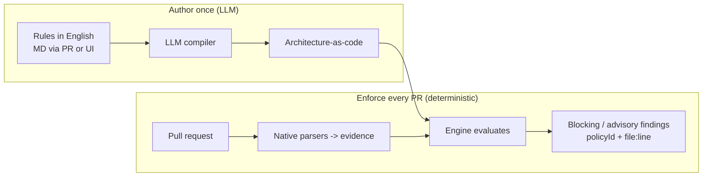

# ArchGuard-AI

**Continuous architecture review at every step — not once.**

Architects define org-, domain-, team- and service-level rules (HLD and LLD) in plain
English. An LLM compiles them into **architecture-as-code** at authoring time. On every
pull request, the pipeline runs those compiled rules deterministically against
parser-derived evidence and blocks only on high-confidence drift — with a policy ID and
`file:line` for every finding.

> The model proposes at authoring time. The compiled rule decides at runtime.

## The idea in one picture



## Repository layout (parallel workstreams)

Each folder has one owner so the team works in parallel. See
[`CONTRIBUTING.md`](./CONTRIBUTING.md) and [`CODEOWNERS`](./CODEOWNERS).

| Area | Folder | What it does |
| --- | --- | --- |
| **Skill / Authoring** | [`skill/`](./skill/) | Natural-language rules → architecture-as-code via LLM ([`SKILL.md`](./skill/SKILL.md)) |
| **Engine** | [`engine/`](./engine/) | Deterministic evaluator, ingest, model, CLI (no LLM) |
| **Pipeline** | [`pipeline/`](./pipeline/) | Trigger the rules from CI on every PR |
| **UI** | [`ui/`](./ui/) | Architect authoring + developer review experience |
| **Pitch** | [`pitch/`](./pitch/) | Internal pitch deck with flow, sequence, and role diagrams |
| **Product idea** | [`idea/`](./idea/) | Scope and positioning docs |

## Quick start

```sh
# Engine
python -m pip install -e ./engine
python -m pytest engine/tests -q

# Compile an architect's rule to architecture-as-code (offline demo, no network)
python skill/generate_architecture.py \
  --rules skill/rules/payments.md \
  --out skill/generated/payments.policy.json

# Run the drift check
python -m archguard.cli --structurizr build/workspace.json \
  --dependency-cruiser build/dependencies.json \
  --terraform-plan build/terraform-plan.json
```

Use [`action.yml`](./action.yml) from a GitHub Actions workflow to run the same check on
a PR; provide its required `changed-files` input as a newline-separated file list. A
ready workflow is in [`pipeline/workflows/archguard.yml`](./pipeline/workflows/archguard.yml).

## Guarantees

- Every finding includes a policy ID and `file:line` evidence.
- Runtime evaluation uses no LLM and never invents graph edges.
- High-confidence undeclared cross-context dependencies block; lower-confidence
  evidence is advisory.
- Synchronization suggestions are emitted only after an in-memory re-evaluation
  proves that the suggested declared relationship resolves the finding.

## Where this is going

See [`idea/00-final-idea.md`](./idea/00-final-idea.md) for the finalized scope: two
policy packs over one multilevel architecture graph — **Design Rules** (SOLID, layering,
dependency inversion) and **Fitness Functions** (org, domain, team, service scope).

