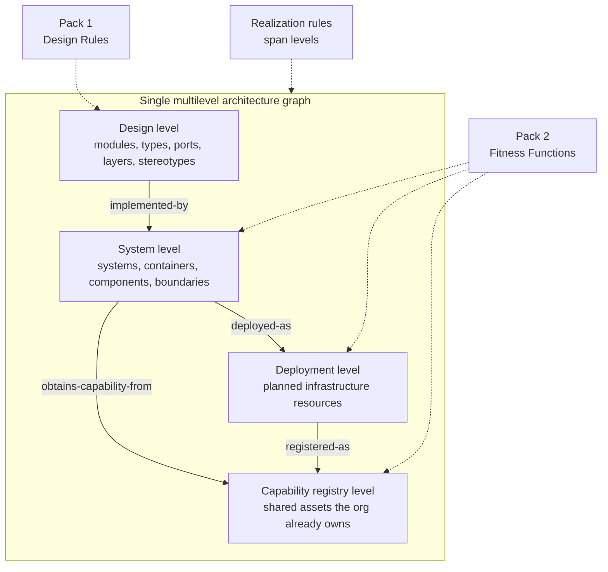
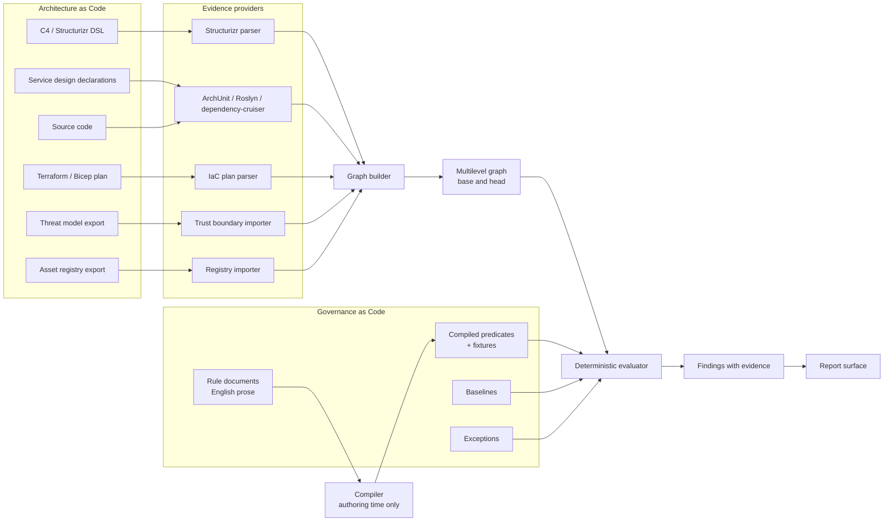
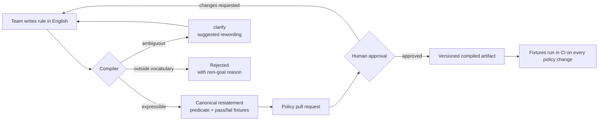
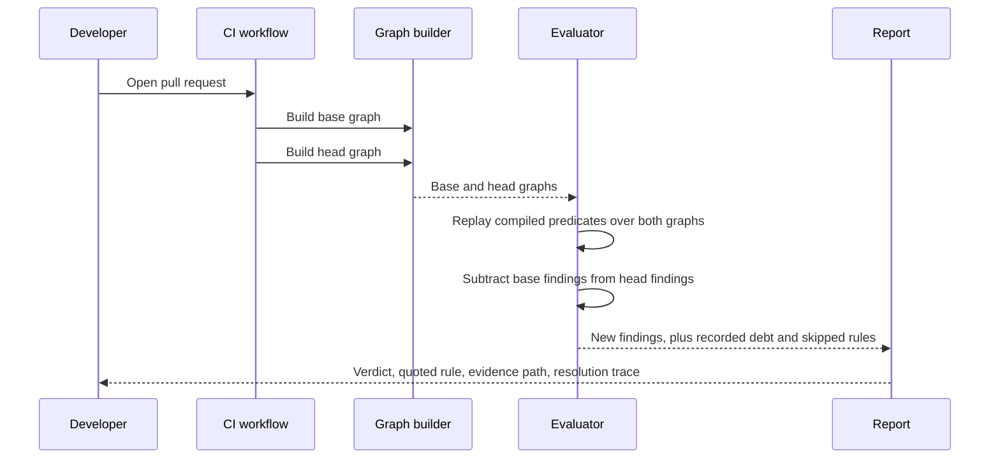
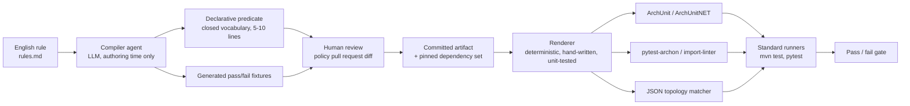

# The Final Idea: ArchGuard-Agent in Two Components

This document supersedes the exploratory framing in ideas 1 to 7 and fixes the scope of the
product. Ideas 1 to 7 remain valid as detail and demo material; this page decides what
ArchGuard-Agent *is*.

## The problem

> **Architecture does not die from violations. It dies from additions that every reviewer
> approved.**

Nobody ever rejected the *first* new first-party application. Or the second. Each one arrived in
a pull request that was locally correct, adequately justified, and approved by a competent
reviewer who had no reason to say no. The fortieth is a catastrophe that no single pull request
caused and no single reviewer could have prevented, because **no human reviewer remembers the
previous thirty-nine**.

That is the shape of real architectural decay. Not the forbidden edge a linter catches — the
accumulated, individually reasonable addition. It is invisible in any one diff and visible only
in aggregate, which makes it precisely the failure mode a machine gate is uniquely qualified for.
Nothing on the market checks it.

### The scenario this product is built around

A platform team owns one registered first-party application. Every feature is supposed to
authenticate through it. But standing up a new application registration is a five-minute
self-service operation, and reusing the shared one requires a conversation with another team, so
every feature ships its own. Two years later the organization owns forty of them — each with its
own secret to rotate, its own consent grants, its own compliance review, its own on-call surface,
and no owner willing to delete it.

Every one of those was approved. No pull request was wrong. The architecture is.

The rule the organization actually wants is one English sentence:

> *A feature must not introduce a new first-party application. It authenticates through its
> team's registered application.*

No existing tool can enforce that sentence on a pull request. That gap is what ArchGuard-Agent is
for, and everything below is in service of it.

## One sentence

ArchGuard-Agent compiles an organization's architecture rules from English into reviewed,
versioned predicates once, then replays them deterministically on every pull request against one
graph spanning code structure, deployed topology, and **the shared platform assets the
organization already owns** — so a change is judged not only on whether it points the wrong way,
but on whether it should exist at all.

The delivery shape is two policy packs — **Design Rules** for low-level design and **Fitness
Functions** for high-level architecture — over one multilevel graph, one rule format, one
compiler, one evaluator, and one report surface.

## Why incumbents cannot follow

[Idea 8](./08-vs-ai-review-agents.md) explains why this is not a review skill. It does not
explain why an established tool could not simply add the capability next quarter. This does, and
it is the stronger moat: **the cardinality of an asset class across an organization is out of
reach for every incumbent by design, not by omission.**

| Incumbent | What it is | Why the rule above is unreachable |
|---|---|---|
| ArchUnit, import-linter, dependency-cruiser, NetArchTest, Konsist | Repository-scoped import-graph analyzers | The model is edges between symbols in **one** compilation unit. "How many of these exist across the organization" is not a question it can ask |
| CodeQL | Whole-repository semantic code analysis | Can find an application registration in one repository. Has no concept of *this team already owns one*, no registry join, no ownership model |
| Checkov, tfsec, OPA and Conftest | Policy over a single infrastructure plan in isolation | Can ban a resource type outright. Cannot answer "is this a duplicate of an approved asset?", because that needs state the plan does not contain |
| Terraform Cloud, Spacelift, env0 | Drift between plan and live infrastructure | Compares one stack against itself. No notion of a shared asset that should have been reused |
| Backstage, service catalogs, CMDBs | Hold the registry of what the organization owns | Inventories, not gates. They record the fortieth application; they never stop the fortieth pull request |

Each is missing a *different* half. The catalogs know what exists but cannot gate. The gates
evaluate but cannot see past one repository. **The contribution here is the join** — an
org-level asset registry read as evidence, evaluated inside the pull-request loop, against a rule
a human wrote in English and approved once.

## The two components

| | **Component 1: Design Rules** | **Component 2: Fitness Functions** |
|---|---|---|
| Altitude | Low-level design, inside a service | High-level architecture, between services |
| Question | Is this code shaped the way we said we design? | Is this system shaped the way we said we architect? |
| Graph level | Design level: modules, types, ports, layers, stereotypes, aggregates | System, deployment and capability-registry levels: systems, containers, components, planned infrastructure, trust boundaries, shared assets |
| Declared in | Per-service design declarations | Structurizr/C4 DSL, infrastructure as code, and the org's asset registry |
| Rules authored by | The owning team | Five tiers, from regulatory down to a single service |
| Examples | SOLID, layering direction, dependency inversion, aggregate access, transaction boundary placement | **No new first-party application per feature**, one gateway per domain, no shared datastore across domains, no undeclared planned path |
| Replaces | The design review comment a senior engineer repeats every sprint | The architecture review board meeting |

**They are policy packs and reporting views, not separate systems.** They are presented
separately because that is how organizations are structured — teams own design, architects own
architecture — but they compile to the same predicate language and run on the same graph. That
matters, because the most valuable rules span both levels.

The prototype in this repository already anticipates this: every `Node` carries a `tier` of
`hld` or `lld` in a single `ArchitectureGraph`, and `evaluate()` compares implementation edges
against declared edges across those tiers. Nothing here is thrown away.

## Architecture

### One graph, two policy packs



- The graph carries four levels in one structure, with explicit cross-level edges
  `implemented-by`, `deployed-as`, `obtains-capability-from` and `registered-as`.
- Pack 1, Design Rules, evaluates the design level.
- Pack 2, Fitness Functions, evaluates the system, deployment and capability-registry levels.
- The **capability registry level** is the org-wide inventory of shared platform assets. It is
  what turns "we already have one of these" from tribal knowledge into a checkable fact, and it
  is the level no incumbent tool has.
- Realization rules span levels and are the designated home for any rule that needs more than
  one level at once. A rule that needs a cross-level join the graph cannot express is rejected
  at authoring time, with that reason.

### The capability registry level

**Nodes.** `capability-provider` — a first-party application, gateway, event bus, telemetry
pipeline, feature-flag service or secret store. Each carries its owning team, its registration
identity, its permission or scope set, and its carrying cost.

**Edges.** `obtains-capability-from`, joining a feature or container to the provider it uses,
and `registered-as`, joining a deployed or planned resource to its registry entry. A resource
with no `registered-as` edge is undeclared, and that is a finding in its own right.

**Evidence providers.** Infrastructure-as-code application-registration resources in Terraform,
Bicep or ARM; client-identifier bindings in service configuration; deployment manifests that
declare new service principals; and an export of the organization's existing asset registry.

ArchGuard reads the registry; it never becomes one. The same discipline that forbids writing a
compiler frontend forbids writing a service catalog. If an organization has no registry, this
level is empty, every proliferation rule resolves to `UNKNOWN`, and the report says so — it does
not quietly pass.

### Components and data flow



- Architecture as Code artifacts are read only by their native parsers, wrapped as evidence
  providers. ArchGuard never writes a compiler frontend.
- The asset registry export is imported, never authored. ArchGuard consumes the organization's
  existing inventory of shared platform assets; it does not become the system of record for it.
- The graph builder assembles one multilevel graph, twice per pull request: once for the base
  commit and once for the head commit.
- Governance as Code holds the English rule documents, the compiled predicates and their
  fixtures, the ratchet baselines, and the exception register.
- The compiler runs at authoring time only. It is the only place a language model appears in
  this diagram.
- The deterministic evaluator reads the graph and the compiled predicates and produces
  findings, each carrying its evidence.
- The report surface renders those findings for developers, teams, architects and leadership.

### Authoring time: the model compiles



- A team writes the rule as a plain-English sentence.
- The compiler attempts to express it in the closed primitive set.
- If it is expressible, the compiler emits a canonical restatement, the predicate, and
  generated pass and fail fixtures.
- If it is ambiguous, the compiler returns `clarify` with a suggested rewording and the author
  edits the sentence. It does not guess.
- If it is outside the vocabulary, it is rejected and the matching non-goal is quoted back.
- The three artifacts are reviewed by a human in a policy pull request, as a diff.
- On approval the compiled artifact is versioned into the repository.
- The fixtures then run in CI on every subsequent policy change, so a later edit cannot
  silently unblock the organization.

### Gate time: no model in the decision path



- The developer opens a pull request.
- The workflow builds the full graph twice: once at the base commit, once at the head commit.
- The evaluator replays every applicable compiled predicate over **both** complete graphs.
- It subtracts the base findings from the head findings to determine what this change
  introduced.
- It emits new findings for the gate, pre-existing findings as recorded debt, and the list of
  rules that did not apply.
- The report returns the verdict, the rule quoted in the team's own words, the evidence path,
  and the policy resolution trace.

## The core mechanism: compile once, replay every pull request

This is the whole product. Everything else is scaffolding around it.

An English sentence is compiled **once** into a typed predicate, that predicate is reviewed by a
human as a diff, and every pull request thereafter **replays** it. There is no model in the
gate decision. Same inputs, same verdict, every time, with the traversal path as evidence.

See [Idea 8](./08-vs-ai-review-agents.md) for why this is materially different from running a
review skill or an AI review agent on every pull request.

### The precise claim, and its limits

The defensible claim is narrow, and stating it narrowly is what makes it survive review:

> **An approved predicate executes deterministically against a pinned set of semantic
> dependencies.**

It does not follow that the interpretation is durable, that the evidence is complete, or that
the verdict is correct. Three consequences follow, and the product must handle all three.

**1. Compile once *per semantic dependency set*, not once forever.** A compiled predicate is a
build output whose meaning depends on inputs that drift. Every compiled artifact therefore pins
and hashes: the rule text, the primitive-set semantics version, the graph schema version, the
declaration bindings it resolved against (layers, stereotype mappings, ownership), and the
evidence-provider versions *and their declared capabilities*. When any pinned input changes, the
rule is revalidated and, where the change could alter meaning, sent back for re-approval.
Generated fixtures test predicate logic; they do not test extraction coverage or symbol binding,
so pinning is the only defence.

**2. `UNKNOWN` is a first-class verdict.** If a selector resolves to nothing, or the evidence
provider cannot see the construct in question, the result is `UNKNOWN` — never `PASS`. Selectors
carry cardinality and coverage assertions, so a rule that quietly stops matching anything is
loud rather than silent. A rule that passes because it found nothing to check is the single most
dangerous failure mode for a governance gate, and the rule-health report names those rules
**vacuously true**.

**3. Evidence has recall limits, and they are published.** An observed edge gives confidence in
what *is*; it says nothing about what the parser could not see. Reflection, dynamic dispatch,
generated code and runtime wiring are invisible to static providers. So high confidence in a
positive finding does not license high confidence in an absence, and the declared-but-unrealized
check is therefore informational only, never a gate.

## The execution model: two stages, not one

The natural first design is: **English → LLM → executable test code (ArchUnit, ArchUnitNET,
pytest-archon) → run it with `pytest` or `mvn test` → gate**, with the generated code committed
back to the repository and regenerated only when the rules file changes.

That instinct is right about the three things that matter — **compile only when the rules
change, commit the artifact, and let mature deterministic runners do the evaluation**. It is
wrong about one thing: what the LLM should emit.

### Why generating test code directly does not survive review

**It does not actually run.** Consider the canonical illustration of the approach:

```python
archrule("Exception Base Check") \
    .match("*.exceptions.*") \
    .should_inherit_from("*.BaseApplicationException") \
    .check()
```

Two defects in five lines, both verifiable against the
[pytest-archon README](https://github.com/jwbargsten/pytest-archon):

1. `should_inherit_from` **does not exist**. pytest-archon is an *import-boundary* tool. Its
   entire vocabulary is `match`, `exclude`, `should_import`, `should_not_import`, `may_import`
   and `should(predicate)`. Inheritance is not expressible at all, so this rule cannot be
   enforced by this provider. ArchUnit *can* express it. The model does not know that, and it
   produced plausible code for a method that was never there.
2. `.check()` is called with no argument, but it "needs either a module object or a string".
   It would raise at collection time.

Its companion rule — "controllers must never import repositories", rendered as
`.match("*.controllers.*").should_not_import("*.repositories.*")` — is worse, because it does
run. **pytest-archon checks transitive imports by default**, so the intended architecture
`Controller → Service → Repository` *violates* it. The generated rule fails the very design it
was written to protect. Nothing about the code looks wrong; the provider's default semantics are
wrong for the sentence.

And even then it would not mean what the sentence means. It matches *modules*, not "Controller
classes" — a controller elsewhere is missed, and unrelated classes inside a controller module are
caught. "Must only talk to Service interfaces" is a positive whitelist; forbidding two package
globs still permits database clients, gateways and arbitrary infrastructure classes.

This is not a prompt-quality problem to be tuned away. It is the predictable behaviour of
free-form code generation against a third-party fluent API, and it is why the **capability
matrix must be per provider** rather than per rule family.

**It is a code-execution vector.** The pipeline would commit model-generated code and then
execute it in CI with repository credentials. The rules file, the source code and the topology
file are all untrusted inputs to the generator, so prompt injection anywhere in that surface
becomes code execution in the build. Mitigations exist; removing the class of problem is
better.

**It destroys the anti-CodeQL guardrail.** The whole scope discipline rests on a closed
vocabulary. Free-form Python or Java can express anything — a lint, a secret scanner, a network
call — so the guardrail evaporates the moment arbitrary code generation is allowed.

**It only looks auditable.** Determinism comes from a human approving the artifact, and nobody
reliably verifies that 40 lines of generated Java faithfully encode one English sentence.
Committing generated imperative code produces the *appearance* of auditability while making the
review harder.

### The correction: compile to a declarative predicate, render deterministically

Split the single translation step in two. The model does the hard part — understanding intent.
Ordinary code we write and test does the mechanical part — emitting runner syntax.



- The English rule is compiled by the agent at authoring time only, when `rules.md` changes.
- The agent emits a **declarative predicate** in the closed vocabulary, plus pass and fail
  fixtures.
- A human reviews both as a diff in a policy pull request — five to ten reviewable lines, not
  forty lines of generated Java.
- The approved artifact is committed with its pinned dependency set.
- A **renderer that we write, test and version** — not a model — translates the predicate into
  the native syntax of whichever provider can actually evaluate it.
- Standard runners execute it: ArchUnit or ArchUnitNET for JVM and .NET, pytest-archon or
  import-linter for Python, a JSON matcher for topology and infrastructure plans.
- The runner's verdict is the gate.

Rendered output is a **build artifact, not a reviewed artifact**: regenerable, ignorable in
review, and never the source of truth. If the renderer has a bug, it is fixed once, with a test,
for every rule — rather than being re-hallucinated per rule.

Three constraints keep this honest:

- **No escape hatch.** pytest-archon exposes `should(predicate)` and ArchUnit exposes custom
  `ArchCondition`. Both are arbitrary code. Neither is ever a compilation target, because one
  escape hatch reopens every problem above.
- **Renderers encode operands as data.** Naive string interpolation into a template recreates
  injection at the last step.
- **Fixtures are a correlated oracle.** Predicate and fixtures come from the same model in the
  same pass, so the same misreading can appear in both and the tests will happily agree with the
  bug. Generated fixtures raise confidence; they do not establish correctness, and the human
  review step is what actually catches a plausible-but-wrong compilation.

This is not an exotic design. [import-linter](https://github.com/seddonym/import-linter) already
proves declarative architecture contracts work: `type = forbidden`, `source_modules`,
`forbidden_modules` in a config file, no generated code anywhere. The contribution here is
compiling English into that shape, and reviewing the compilation.

### What the two-stage model keeps and what it costs

**Keeps** every benefit of the original instinct: mature runners do the evaluation, real source
code is scanned, no model runs at gate time, CI is fast and cheap, and the artifact is committed
and diffable.

**Costs** expressiveness. Anything outside the vocabulary cannot be compiled — which is
precisely the intended constraint, and why `clarify`, advisory routing and the human
classification step exist as escape hatches. The vocabulary must then grow deliberately, through
a reviewed change to the renderer, with the fixtures that come with it.

### Caching, stated correctly

"Recompile only when the rules file changes" is the right instinct but the wrong trigger. The
compiled predicate binds to package structure, declared stereotypes, framework conventions and
the topology file — so the rules file can be untouched while the artifact silently becomes
wrong. A rename from `repositories` to `persistence` leaves `should_not_import("*.repositories.*")`
matching nothing and passing forever.

The correct trigger is the **pinned dependency set**: rule text, primitive semantics, graph
schema, declaration bindings and provider capabilities. Any change to those revalidates the
rule; a change that could alter meaning sends it back for approval. Combined with `UNKNOWN`
verdicts and coverage assertions, this is what makes "the same codebase never randomly passes or
fails" actually true rather than merely intended.


The most common way a governance tool loses credibility is claiming to prove something its
evidence cannot support. So the primitive-to-evidence relationship is published as a capability
matrix, and **only structurally observable properties with adequate coverage may block a merge**.

| Rule family | What the graph can actually prove | Gate status |
|---|---|---|
| Layering direction, allowed dependencies, cycles, module exports, placement | Directly observable structural relationships | **May block** |
| Dependency inversion, aggregate access path, cross-cutting concern placement, data access placement | Directly observable, given declared stereotypes and layers | **May block** |
| Interface segregation width, fan-in and fan-out, coupling and instability budgets | Directly computed metrics over observed edges | **May block** as a named proxy, once rule health allows |
| Single responsibility, open-closed | **Not provable.** Stereotype uniqueness and dependency budgets are *proxies*, and are labelled as proxies in every report | Advisory, or blocking only by explicit team opt-in |
| Liskov substitution, semantic contract compatibility | **Not provable structurally.** `must-implement` proves a relationship exists, not that the contract is honoured | Advisory only, flagged for human review |
| Resilience policy, idempotency | Only that a policy was **declared**, never that it is effective at runtime | Advisory only |
| Deployment and drift | A Terraform or Bicep plan is **proposed** state, not deployed reality | May block on plan divergence; true deployed drift requires the scheduled sweep against live state |
| Shared-asset proliferation and reuse | A declared asset class counted over a governed registry and the change under review — directly observable, given the registry | **May block** for assets whose creation is visible in the repository. Assets created outside any repository are visible only to the scheduled sweep |
| Operational metrics, latency, cost, error budget | Requires a bound external metric source | **Never gates.** Trend only |
| Trade-off and judgement | Nothing | **Never gates.** Routed to the ARB |

Two disciplines follow. Proxies are always named as proxies in the report, so nobody believes
the tool proved SOLID. And the documentation distinguishes **implemented** capability from
**roadmap**: today's prototype ships three structural checks, not ten families.

## The scope guardrail: staying architecture, not becoming CodeQL

### Two tests, honestly separated

An earlier draft claimed a four-part "admission test" enforced by the compiler. Two of those
four parts are human judgement, and dressing judgement up as a mechanism is exactly the kind of
overclaim this product is meant to avoid. So they are separated.

**Test A — expressibility and evidence capability. Mechanical, decided by the compiler.**

1. Every scope selector must bind to a **declared** design element — a layer, port, stereotype,
   aggregate, module, context, team or service that a human wrote into the model.
2. The predicate must be drawn **only from the closed primitive set**, which contains no
   dataflow, no control-flow, no statement-level and no value-inspection primitives.
3. The evidence required must be within the declared capability of an available provider.
4. The rule must bind to an owner, a tier and a severity.

**Test B — architecture-governance classification. Human, in the policy pull request.**

The compiler *asks*; a person *answers*: would violating this be raised in a design review or
recorded in an ADR, and can the remediation be stated as a design move — move, invert, split,
introduce an abstraction, decouple?

Test A does most of the work, because the guardrail is the **expressive limit of the primitive
set**: nothing CodeQL-shaped can be written down. But Test A alone is not sufficient, and the
counter-examples show why:

- *"Controllers may not call `Runtime.exec`; they must cross through `CommandExecutionPort`"*
  passes Test A — it is a legitimate `must-cross-via` over declared stereotypes — while being
  substantially a prohibited-API check. Test B is where a human decides whether port discipline
  is the real intent or whether this is a security rule wearing architecture's clothes.
- *"Every internet-facing service must have a threat model reviewed within 90 days"* fails the
  design-move question and is still legitimate governance. It is admitted as a **staleness**
  type rule, which is why that type exists as a first-class category rather than being forced
  through the structural vocabulary.

The claim, stated correctly: **the compiler enforces expressibility; humans classify
governance.**

**The line to remember:** if the fix changes **where code lives or who may talk to whom**, it is
ArchGuard; if it changes **what a line does**, it is CodeQL's job.

### Permanent non-goals

Quoted back to the author in every rejection: injection, XSS, SSRF and CWE detection · taint
tracking · null dereference, resource leaks, off-by-one · dead code · formatting and naming-only
lint · secret scanning · SCA, CVE and licence checks · coverage-percentage policing ·
performance micro-optimisation · generic code-smell scoring · statement-level fix suggestions.

ArchGuard **consumes** those tools' outputs as evidence where useful. It never re-implements
them.

## Component 1: Design Rules (low-level design)

### The design level of the graph

Assembled from parsers that already exist — ArchUnit, Roslyn, dependency-cruiser, tree-sitter —
wrapped as evidence providers that **declare their own capabilities and blind spots**.

- **Nodes:** module, package or namespace, type, interface or port, public member, layer,
  stereotype, aggregate, test type.
- **Edges:** depends-on, implements, extends, instantiates, injects, calls-across-boundary,
  exports, annotated-with.
- **Declarations** — the Architecture as Code for low-level design: declared layers and their
  allowed direction, module public surface, stereotype mappings, aggregate roots, framework and
  infrastructure namespaces, and modules tagged `deprecated` or `strangler-legacy`.

If a fact is neither declared nor parser-derived, no rule may reference it.

### What comes under Architecture as Code for low-level design

Ten families. These ship as the starter catalog, so most of a team's rules are picked rather
than written. Gate status per family is governed by the capability matrix above.

| Family | Representative rules |
|---|---|
| **A. SOLID** | **SRP:** one declared stereotype per type; fan-out, member-count and injected-dependency budgets *as proxies*. **OCP:** types tagged `closed` are extended, not edited; no type-switch over a declared hierarchy *as a proxy*. **LSP:** overrides flagged for review when they narrow a declared contract; advisory only. **ISP:** interface width budget; depend on role interfaces, not fat ones. **DIP:** domain and application depend only on abstractions; no direct construction of infrastructure types in the domain. |
| **B. Layering and boundaries** | Declared layer direction; no layer skipping; domain must not reference framework namespaces; module public surface control; package and class acyclicity. |
| **C. DDD tactical design** | Aggregate root is the only entry point; one repository per aggregate; value objects immutable; domain events raised only inside aggregates; anti-corruption layer at a declared external boundary; ORM entities must not cross the API boundary. |
| **D. Contracts and compatibility** | Contract and DTO shape; no inheritance in wire contracts; exported-interface breaking-change detection against the base branch; domain throws domain errors, adapters translate. |
| **E. Cross-cutting concern placement** | Logging, telemetry and audit only via the declared abstraction and only in permitted layers; authentication and authorization at the declared boundary; **transaction boundaries start in application services**, not controllers or repositories; caching only in the declared adapter; config and secrets only through the declared port; feature flags via the declared abstraction; tenant context propagated across the declared boundary. |
| **F. Resilience by design** | Every outbound adapter **declares** timeout, retry and circuit-breaker policy; message handlers declared idempotent; no unbounded fan-out. Declaration only — effectiveness is unprovable statically and is never gated. |
| **G. Evolvability budgets** | Afferent and efferent coupling, instability, abstractness, distance from the main sequence, cohesion, fan-in and fan-out — as budgets and ratchets, never as an absolute quality score. Complexity appears only as an SRP proxy, never as a lint. |
| **H. Test architecture** | Domain unit tests must not touch infrastructure; test placement mirrors module structure; every declared integration point has a contract test. |
| **I. Data access design** | Raw SQL only inside repository adapters; no cross-aggregate joins; no cross-service database access; schema-affecting entity changes require a migration artifact. |
| **J. Ownership and lifecycle** | Modules changed only by the owning team or with owner review; no *new* dependencies on `deprecated` modules; new code must not increase dependence on a `strangler-legacy` module. |

### The closed primitive set

**Structural primitives**, which constrain relationships between things that already exist:

`may-not-depend-on` · `must-depend-only-on-abstractions` · `must-be-instantiated-via` ·
`must-reside-in` · `must-implement` · `must-not-be-exported` · `must-not-cycle` ·
`must-not-exceed(metric, budget)` · `must-not-regress(finding-set)` · `must-be-annotated-with` ·
`must-cross-via`.

**Reuse primitives**, which constrain what may be *brought into existence*:

`must-obtain-capability-via(capability, provider)` · `must-reuse(asset-class, scope)` ·
`must-not-exceed-count(asset-class, scope, n)` · `must-not-introduce(asset-class)`.

Every primitive above the line is dependency-shaped: each asks whether an edge between two
existing nodes is permitted. That is the entire vocabulary of every architecture-test tool in the
field, and it is exactly why none of them can express the rule this product is built around.
**Existence is not a dependency.** A second question had to be added to the language: *should
this thing exist at all, given what the organization already owns?*

| Primitive | What it asserts | Canonical use |
|---|---|---|
| `must-obtain-capability-via(capability, provider)` | Elements in scope obtain a named capability from a declared provider. A **positive obligation**, not a prohibition | A feature obtains *identity* from its team's registered application |
| `must-reuse(asset-class, scope)` | Only registry-declared instances of an asset class may be referenced within a scope | Only a registered gateway may be routed through |
| `must-not-exceed-count(asset-class, scope, n)` | A cardinality budget over a scope. `n = 1` is the singleton form | One telemetry pipeline per domain |
| `must-not-introduce(asset-class)` | Pure ratchet: the count at head may not exceed the count at base | No net new first-party applications |

`must-obtain-capability-via` is the one that matters most, because it is what keeps this
*architecture* rather than a prohibition list. A rule that only forbids leaves a developer with a
genuine need and no route, and a developer with no route routes around the gate. A rule that
names the provider states the intended design and makes the remediation obvious.

Note what is still absent: no primitive inspects a value, follows data, or reasons about control
flow. That absence *is* the CodeQL boundary, and the four additions preserve it — counting
declared instances of a declared asset class is not dataflow analysis. **Test A therefore holds
unchanged.** Every operand is a declared asset class or a registry-resolved provider, both of
which a human wrote into the model.

Test B holds too, and more comfortably than most structural rules manage. *"We are standing up
another first-party application"* is not a borderline architecture question; it is among the most
common items on a real architecture review board's agenda, and the remediation is a textbook
design move: **reuse the existing one.**

## Evaluation: complete graphs, delta reporting

Diff-only evaluation is fatal for an architecture tool, because architectural meaning is
graph-global and the evidence for a violation is frequently **not** in the diff. Reclassifying a
module from infrastructure to domain forbids an `A → B` edge whose source line nobody touched.
Removing a gateway invalidates paths across the whole system. A one-line import closes a cycle
made of unchanged edges.

So the model is: **evaluate completely, report on the delta.**

1. Build the complete graph at base and at head.
2. Replay every applicable predicate over **both**.
3. Gate on the difference in **finding sets**: findings present at head and absent at base.
4. Report pre-existing findings as recorded debt, attributed to the baseline rather than to this
   author.
5. Re-evaluate at the merge-queue head, so two independently clean pull requests that together
   introduce a violation are caught on the second merge instead of blaming the wrong person.
6. Run a scheduled full evaluation, and a cross-repository sweep, to catch drift originating
   outside any single pull request.

Attribution and inline comment placement are presentation concerns, solved after the verdict.
They never restrict what is evaluated.

### The ratchet, corrected

A ratchet is not a predicate over one graph, so it is defined over a pinned pair.

- **Finding-set ratchets, not score ratchets.** "No new cycles" and "no new cross-boundary
  dependencies" are stable and attributable. Aggregate scores drift with parser upgrades,
  renames and aggregation changes, so they are **reported as trends and do not gate**.
- **Pinned inputs.** Every ratchet comparison pins the base and head commits, the metric
  provider version, and the element identity scheme, so a provider upgrade cannot masquerade as
  a regression.
- **Merge-order safety.** Ratchets are re-evaluated at the merge-queue head, which is where
  concurrent pull requests are reconciled.
- **Legitimate regressions.** A staged migration may honestly worsen a metric. That is a
  time-boxed migration budget approved through the exception path — never a silently raised
  threshold.

This also resolves an inconsistency in the earlier draft: **finding-set ratchets may gate;
evolutionary metric scores never do.**

## Component 2: Fitness Functions (high-level architecture)

### Multi-tier scope model

| Tier | Owner | Scope | Change path |
|---|---|---|---|
| **T0 Regulatory** | Security and the ARB | Everything: data residency, PCI, isolation | Formal ARB. No exception, no demotion, ever |
| **T1 Org** | Architecture Review Board | All systems | ARB review |
| **T2 Domain** | Domain architect | One domain or bounded-context group | Domain review |
| **T3 Team** | Owning team | Systems and containers the team owns | Normal team pull request |
| **T4 Service** | Service owner | One service or one repository | Service owner pull request |
| **X Exception** | Named approver | One rule, one scope, one expiry date | ADR-backed, time-boxed, self-terminating |

### Precedence: conjunctive inheritance, not override

"A team rule may only be stricter than the org rule" is **undecidable** for arbitrary
predicates, and pretending otherwise creates a loophole. Consider: the org says *domain may
never depend on legacy*; the team says *domain may depend on legacy only through an
anti-corruption layer*. The team rule sounds more constrained and is in fact a relaxation. Or:
`fan-out <= 5` versus `must-not-regress(fan-out)` — which is stricter depends entirely on the
current value.

ArchGuard therefore does not attempt general implication. It removes the problem instead:

- **Inherited rules stay conjunctively active.** A lower tier never replaces a higher-tier rule.
  Both evaluate. Adding a rule can only add constraints, so a new rule is always admissible.
- **Supersession is allowed only within a formally ordered family** — the same primitive with a
  comparable parameter, such as budget 3 superseding budget 5, or an allowed set that is a
  strict subset, or `advisory` becoming `blocking`.
- **Everything else is incomparable.** Not accepted, not rejected: routed as an **unprovable
  override** to the owner of the tier being overridden. The compiler's honest answer is "I
  cannot prove this is stricter."
- **Scope narrowing is a relaxation.** Excluding elements from an inherited rule's scope is an
  exception with an expiry date, not a policy edit. This closes the loophole where a team obeys
  the letter of only-stricter while scoping the rule down to nothing.

### Fitness function types, and which may gate

| Type | Evaluated against | Cadence | May block? |
|---|---|---|---|
| **Structural** | The system level of the graph | Pull-request triggered | Yes, deterministic |
| **Realization** | Design level versus system level, through `implemented-by` | Pull-request triggered | Yes, for positive findings at high confidence; absence of evidence is informational |
| **Deployment and drift** | Terraform or Bicep **plan**, which is proposed state | Pull request, plus a sweep against live state | Yes on plan divergence; deployed-reality drift only from the sweep |
| **Proliferation** | The capability registry level against the head graph: what this change brings into existence, versus what the organization already owns | Pull request, plus a scheduled registry sweep | Yes. The finding is directly observable and the remediation is a design move |
| **Staleness** | Freshness of a required artifact, such as a threat model against imported trust boundaries | Pull-request triggered | Advisory by default; the owning function may opt in |
| **Operational and evolutionary** | A bound external metric source | Continuous or scheduled | **No.** Trend only |
| **Holistic and judgement** | Explicitly not automatable | On demand | **No.** Routed to the ARB with a prepared packet |

An operational rule with no metric binding is rejected at authoring time rather than passing
silently forever.

### Proliferation is additive, not a redesign

The most important property of the `proliferation` type is how little it changed. It reuses the
spine exactly as built:

- **Base-and-head evaluation** already gives `must-not-introduce` its meaning for free. The
  primitive *is* the finding-set delta the evaluator already computes.
- **`UNKNOWN` never degrades to `PASS`**, so an unresolvable configuration binding surfaces
  rather than passing.
- **Exceptions with an expiry** already provide the escape hatch a legitimately new asset needs.
- **The self-approval hole** and its governed-declarations answer already cover the registry.
- **The policy resolution trace** already explains why a rule stayed silent.

An entirely new rule class landing with zero changes to the evaluator contract, the verdict
model, the exception path or the report surface is itself the credibility argument: the spine was
designed correctly, and this is what it looks like when a design pays out.

### What proliferation rules honestly cannot do

Stating the limits precisely is what makes the capability believable.

- **Recall is bounded by what is in a repository.** An application created by clicking through a
  portal never appears in any pull request, so the gate cannot see it. The pull-request gate
  covers the code-visible path; a **scheduled registry sweep** covers the rest. The difference
  between them is published as its own report — *assets that exist but were never declared*. The
  claim is never "the gate prevents creation"; it is "the gate prevents creation through the
  reviewed path, and names the unreviewed path".
- **An unresolvable binding is `UNKNOWN`, not `PASS`.** If a client identifier in configuration
  cannot be resolved to a registry provider, the rule says it does not know. A proliferation rule
  that silently matched nothing would be the most dangerous rule in the catalog, because the
  metric it protects only moves in one direction.
- **The self-approval hole bites hardest here.** A developer who adds their brand-new application
  to the registry in the same pull request defeats the rule completely. The registry is therefore
  a **governed input under its own `CODEOWNERS`**, exactly like `architecture/` and `design/`: a
  registry addition is a policy change routed to the platform owner even when it arrives inside a
  feature pull request. This is the existing mechanism, reused, not a new one.
- **Legitimate new assets exist.** A separate tenant, a compliance boundary, a data-residency
  requirement — each is a real reason for a genuinely new application. The rule never bans
  absolutely. It routes to the platform owner with a justification and an expiry date, which is
  the difference between governance and obstruction.

### The starter catalog: reuse over rebuild

One bespoke rule about first-party applications is a feature. A family that teams pick from is a
product — and it also answers the adoption question nobody asks until rollout: **nobody writes
architecture rules on a blank page.**

| Catalog rule | Asset class | Compiles to |
|---|---|---|
| One identity application per team | first-party application registration | `must-not-introduce(first-party-app)` + `must-obtain-capability-via(identity, team registered app)` |
| One gateway per domain | API gateway or front door | `must-not-exceed-count(gateway, domain, 1)` |
| One telemetry pipeline | logging and metrics sink | `must-reuse(telemetry-pipeline, org)` |
| One feature-flag system | flag provider | `must-obtain-capability-via(feature-flags, declared provider)` |
| One datastore per bounded context | database instance | `must-not-exceed-count(datastore, context, 1)` |
| One authentication library | auth SDK | `must-reuse(auth-library, org)` |

Every row is the same shape: an asset class that is cheap to create once and expensive to own
forever. Teams adopt by picking a row and naming their provider, so the free-form compiler is
reserved for the genuinely bespoke minority — which is also where compilation fidelity risk is
concentrated.

### Carrying cost: turning the gate into a budget instrument

Every proliferation finding publishes the recurring annual burden the change signs the
organization up for: secret and certificate rotation, compliance and SDL review, tenant consent
maintenance, on-call surface, and eventual deprecation work. The finding does not merely say
*this violates a rule*; it says **this pull request adds roughly N engineer-hours per year,
permanently, and here is the asset that already does this.**

That reframes the conversation from architectural preference — which developers are entitled to
argue with — to committed operational spend, which is much harder to wave through. It also gives
the organization the only architecture metric leadership has ever actually asked for: **net new
shared platform assets per quarter, trending toward zero**, with an attached cost avoided.

Two honesty constraints. The cost is a **declared property of the asset class**, set by the
platform owner in the registry, not a number ArchGuard invents. And it is reported as a range
with its basis shown, because a single confident figure invites an argument about the figure
instead of about the architecture.

### The policy resolution trace

Every report prints the effective rule set: which rules applied, which returned `UNKNOWN`, and
which were skipped and why — out of scope, superseded within an ordered family, or suppressed by
exception `N` expiring on a given date. An automated gate that cannot explain **why it stayed
silent** is as untrustworthy as one that cannot explain why it fired.

### What actually replaces the manual architecture review

- The architect's checklist becomes versioned rules with `id`, `owner`, `severity`, `mode`,
  `evidence`, `review_by`, and the original prose.
- The agent prepares the **ARB review packet** for the residual human decisions: the
  architecture delta, impacted rules, evidence, risk and remediation options.
- The board's work shifts from *reading every pull request* to **curating rules, deciding
  exceptions, and reviewing rule health**.
- The holistic and judgement type exists precisely so the product never claims to have automated
  taste. Architecture is trade-offs, and trade-offs need people.

## The shared spine

Both packs use the same rule document, compiler, expressibility test, evaluator contract, and
exception path. Here is the rule this product exists for, in full:

```yaml
id: PLT-001                 # stable, cited in every report, never reused
title: A feature must not introduce a new first-party application
tier: org                   # T0 | org | domain | team | service
owner: platform-identity    # matched against CODEOWNERS
scope: [ "asset-class:first-party-app", "tenant:corp" ]
type: proliferation         # structural | realization | deployment | proliferation | staleness | operational | holistic
severity: high
mode: blocking              # blocking | advisory
evidence: [ asset-registry, iac-plan, service-config ]
asset_class: first-party-app
capability: identity
provider: registry:team-registered-app
carrying_cost: 20-30h/year  # declared by the platform owner; published in every finding
review_by: 2026-12-31       # mandatory, so stale rules surface instead of rotting
body: >
  A feature must not introduce a new first-party application. It authenticates through
  its team's registered application. If the registered application lacks a permission the
  feature needs, extend that application rather than standing up another one.
```

It compiles to two primitives, and it is worth seeing how short the compiled form is:

```
must-not-introduce(first-party-app)
  AND must-obtain-capability-via(identity, registry:team-registered-app)
```

Five reviewable lines of policy, not forty lines of generated Java. And in compiling it the agent
returned one `clarify` rather than guessing, because the English was genuinely ambiguous:

> *Does a registration created solely for a development or test tenant count as a new first-party
> application? The sentence does not say, and the two readings gate differently.*

That question is the product working correctly. The compiler that guesses here encodes a rule
nobody agreed to; the compiler that asks gets one sentence added to `body` and a scope predicate
that a human approved on purpose.

**The end-to-end story, across both packs:** an org fitness function says *payments must not
synchronously depend on customer profile* at the system level. The payments team's design rule
says *the checkout domain layer may depend only on ports, and the profile projection is the only
permitted source* at the design level. One pull request, one report, two levels, one graph. No
single existing tool does both.

<details>
<summary>The structural rule referenced above, in the same schema</summary>

```yaml
id: PAY-014                 # stable, cited in every report, never reused
title: Checkout must not synchronously depend on customer profile
tier: team                  # T0 | org | domain | team | service
owner: payments             # matched against CODEOWNERS
scope: [ "tag:payments", "container:Checkout API" ]
type: structural            # structural | realization | deployment | proliferation | staleness | operational | holistic
severity: high
mode: blocking              # blocking | advisory
evidence: architecture-model
review_by: 2026-12-31       # mandatory, so stale rules surface instead of rotting
body: >
  During checkout, payment systems must not make a synchronous call to any customer
  profile service. Profile data needed at checkout must come from a locally owned
  projection kept up to date by events.
```

</details>

## Repository layout and ownership

```
architecture/                          # System level: Structurizr/C4 DSL, trust boundaries
design/                                # Design level: layers, ports, stereotypes, aggregates, legacy tags
registry/                              # Capability registry level: shared assets, owners, carrying costs
governance/
  fitness/{org,domain,team,service}/   # Pack 2 rules
  design-rules/<team>/                 # Pack 1 rules
  catalog/                             # starter templates for both
  exceptions/                          # ADR-backed, expiring
  compiled/                            # restatement + predicate + fixtures + pinned dependency set
  baseline/                            # ratchet baselines and recorded debt
```

`CODEOWNERS` maps each directory to its owner, so a team structurally cannot edit another team's
rules or the org tier. `registry/` is owned by the platform team that owns each asset class,
which is what stops a developer from approving their own new asset in the pull request that
creates it.

### Five verdicts, and the move that defeats every gate

A gate that answers only pass or fail will lie. Missing topology, an unsupported language, a
parser crash, a selector that matches nothing — each is a *failure to know*, and each becomes a
silent pass under a binary verdict. Every rule therefore resolves to one of five:

| Verdict | Meaning | Gate behaviour |
|---|---|---|
| `PASS` | Evaluated; no violation | Proceed |
| `FAIL` | Evaluated; violation found | Blocks at T0–T1 |
| `UNKNOWN` | Not decidable on available evidence | Never a pass; surfaces, and blocks only where the rule declares it must |
| `ERROR` | Provider, parse or binding failure | Blocks the check itself; never silently green |
| `SKIPPED` | Out of scope, superseded, or covered by a live exception | Reported with the reason |

A selector matching zero elements is `UNKNOWN`, never `PASS`. Vacuous truth is the most common
way an architecture gate quietly stops working.

**The self-approval hole.** Rules bind to declarations — stereotypes, layer membership, service
tags, bounded-context assignment. If a developer can change code *and* its classification in the
same pull request, the cheapest way past any rule is to relabel: move the class out of
`controllers`, drop the `web-service` tag, redraw the edge. The gate goes green and the
architecture is worse.

Declarations are therefore governed inputs, not developer-editable code. `architecture/` and
`design/` are owned separately from implementation; a change to them is a policy change that
routes to the architecture owner even when it arrives in a feature pull request. Every
classification change is diffed and reported — a pull request that removes a stereotype and the
finding attached to it is exactly the event a reviewer needs to see, and is reported as a
governance event rather than an absence.

## Reports

| Report | Audience | Contents |
|---|---|---|
| **Pull-request check and inline review** | Developer | Verdict, the rule quoted in the team's own words, `file:line` evidence and graph path, policy resolution trace, design-level remediation, exception request link |
| **SARIF and JSON artifact** | Tooling | Renders natively in the Files changed view and the Checks tab |
| **Carrying-cost statement** | Developer, team lead, finance | Attached to every proliferation finding: the recurring annual burden this change commits the organization to — secret and certificate rotation, compliance and SDL review, tenant consent, on-call surface, eventual deprecation. Stated as a range with its basis, never as a single confident number |
| **Shared-asset inventory and trend** | ARB, platform owners, leadership | Assets per class per team over time, net new per quarter, carrying cost avoided, and the undeclared-asset gap between the registry sweep and the gate |
| **Team scorecard** | Team lead | Own-rule and org-rule pass rates, active exceptions with expiry, recurring violations, ratchet trends, recorded debt |
| **Org and domain scorecard** | ARB, leadership | Risk posture by domain and severity, blocked high-risk changes, drift backlog |
| **Drift and trend report** | Architects | Scheduled sweep: plan and live state versus declared model, coupling trend, stale artifacts |
| **Exception register** | Governance | Every deviation, approver and expiry; expired exceptions become findings in their own right |
| **Rule-health report** | Rule owners | Fire count, false-positive rate, `UNKNOWN` rate, vacuously-true and unused rules, overdue `review_by`. **Recommends** a demotion pull request; never changes effective mode by itself |
| **ADR draft** | Team and ARB | Generated only for accepted exceptions and high-impact decisions |

### Demotion is a governed change, not an automatic one

An earlier draft had noisy rules auto-demoted to advisory. That is a relaxation with no
approver, no expiry and no record — and it would have silently downgraded a T0 rule that cannot
be excepted at all. Corrected: **rule health opens a pull request proposing demotion, and a
human merges it.** The mechanism that keeps the gate trusted must itself be governed.

For the same reason, prose that never compiled cannot "land as an advisory result": there is no
predicate to execute. It is routed as a human-review task and labelled as such, never presented
as an evaluated verdict.

## Where the ideas land

| Idea | Lands in |
|---|---|
| [1 Automated ARB for PRs](./01-automated-arb-pr-review.md) | The pull-request surface shared by both packs |
| [2 Drift Radar](./02-architecture-drift-radar.md) | Pack 2, deployment and drift type |
| [3 Remediation Copilot](./03-remediation-copilot.md) | The report layer, constrained to design moves |
| [4 Policy Playground](./04-policy-playground.md) | The authoring surface for the compiler |
| [5 Scorecard and ADR](./05-risk-scorecard-adr.md) | The report layer and the exception path |
| [6 Per-team fitness functions](./06-team-fitness-functions.md) | Pack 2's tier model, extended down into Pack 1 |
| [7 Threat model bridge](./07-threat-model-bridge.md) | Pack 2, staleness type |
| [8 Versus AI review agents](./08-vs-ai-review-agents.md) | The positioning answer for the compile-once mechanism |

## Delivery phases

- **Phase 0 — Scope freeze.** Ratify the expressibility test, the non-goals and the capability
  matrix; fix the rule schema, the evaluator contract, and both halves of the primitive set.
- **Phase 1 — The proliferation loop.** The wedge, end to end, for **one** asset class: the
  registry importer, infrastructure-plan and service-configuration evidence, the
  `must-not-introduce` and `must-obtain-capability-via` primitives, one catalog rule compiled
  from English and human-approved, the carrying-cost statement, and a pull-request report with
  `file:line` evidence and the name of the asset that should have been reused.
- **Phase 2 — Pack 1 MVP.** One language, one service: design declarations, the design-level
  graph builder over existing parsers, five or six structural primitives, roughly ten catalog
  rules across layering and dependency inversion, fixtures in CI, and the same report surface.
- **Phase 3 — Pack 2 MVP.** Tiers T0 to T4, the scope resolver, conjunctive inheritance with the
  unprovable-override path, the policy resolution trace, structural and realization evaluators
  gating, and the expiring exception path.
- **Phase 4 — Correctness scaffolding.** Base-and-head evaluation, finding-set deltas, pinned
  dependency sets, `UNKNOWN` handling, merge-queue re-evaluation.
- **Phase 5 — Reports.** SARIF, team and org scorecards, the shared-asset inventory and trend,
  exception register, rule health, ADR drafting.
- **Phase 6 — Beyond the pull request.** Scheduled sweeps against live state and the live asset
  registry, the undeclared-asset gap report, operational metric bindings as trends, staleness
  types, ARB review packet.
- **Phase 7 — Adoption.** The full reuse-over-rebuild catalog, baselines and recorded debt for
  legacy code, advisory-first rollout, false-positive governance through proposed demotion pull
  requests.

## Risks and mitigations

| Risk | Mitigation |
|---|---|
| Scope creep into CodeQL and lint | The closed primitive set makes non-architectural rules inexpressible; the human classification step handles the residue; non-goals are quoted in rejections |
| The compiler encodes a subtly wrong interpretation | Canonical restatement plus generated fixtures reviewed as a diff before a rule may block |
| **The compiled predicate goes semantically stale** | Every artifact pins its rule text, primitive semantics, graph schema, declaration bindings and provider capabilities; changes trigger revalidation or re-approval |
| **A rule silently stops matching anything** | Cardinality and coverage assertions on selectors; `UNKNOWN` never degrades to `PASS`; vacuously-true rules surfaced by rule health |
| **The tool claims to prove what it cannot** | Published capability matrix; proxies labelled as proxies in every report; only structurally observable properties may gate |
| Legacy codebases drown in violations | Complete evaluation with finding-set deltas; pre-existing findings recorded as debt, not attributed to this author |
| Concurrent pull requests defeat the gate | Re-evaluation at the merge-queue head, plus a scheduled full sweep |
| Teams contradict the org tier | Conjunctive inheritance; supersession only within a formally ordered family; everything else routed as an unprovable override; scope narrowing counts as an exception |
| A noisy rule destroys trust in the gate | False-positive rate is a first-class metric, and demotion is a proposed, human-merged pull request rather than an automatic relaxation |
| Over-claiming that architecture review is automated | The explicit holistic and judgement type, routed to the ARB with a prepared packet |
| **A developer relabels their way past a rule** | Declarations are governed inputs owned separately from implementation; every classification change is diffed and reported as a governance event |
| **A developer registers their brand-new asset in the same pull request** | The asset registry is a governed input under its own `CODEOWNERS`, not developer-editable. A registry addition is a policy change routed to the platform owner even when it arrives inside a feature pull request — the same mechanism that closes the relabelling hole, reused |
| **Assets created outside any repository are invisible to the gate** | Recall is published rather than claimed. The pull-request gate covers the code-visible path only; the scheduled registry sweep covers portal and click-ops creation, and the difference between them ships as its own report — *assets that exist but were never declared* |
| **Compilation fidelity is below what architects will trust** | The nearest published work reports a 82.2% positive-test pass rate in a narrower domain; review, fixtures, `UNKNOWN` and refusal are load-bearing, and fidelity is never claimed as solved |
| **Name collision** with the established open-source ArchGuard project **and with a live "ArchGuard AI Reviewer" Marketplace action** | **Resolved: the product is renamed to Extant.** See "The name" below and [Idea 9](./09-prior-art-and-positioning.md) |
| **The registry does not exist, or is badly maintained** | Every proliferation rule resolves to `UNKNOWN` and says why. The tool never infers a registry from code, because a guessed inventory would make the one metric it publishes untrustworthy |

## Success metrics

Blocked high-severity violations · **net new shared platform assets per quarter, trending toward
zero** · carrying cost avoided per quarter · registry coverage, meaning the share of live assets
that are declared · false-positive rate per rule against the agreed threshold ·
`UNKNOWN` and vacuously-true rule counts · share of rules taken from the catalog versus bespoke ·
exception count and mean age to expiry · recorded debt burn-down per team · reduction in manual
ARB pull-request reviews · rules overdue for `review_by`.

## The name

**Decided: Extant.**

Two projects already ship as ArchGuard — `archguard/archguard`, the established Thoughtworks-
initiated governance workbench, and `archguard-labs/action`, an "ArchGuard AI Reviewer" on the
GitHub Marketplace whose design this document explicitly argues against. Keeping the name means
competing for search results against the first while being mistaken for the second. It was the
cheapest thing to change and the most expensive thing to leave wrong, so it is now changed.

**Extant** — *still in existence; surviving.* It names the question the gate asks before every
addition: *does an approved instance of this already exist?* Three reasons it is the right word:

- It encodes the wedge rather than the mechanism. `Guard`, `Lint`, `Check` and `Sentry` all
  describe a security or lint posture, which is exactly the drift the non-goals exist to prevent.
- It is a positive frame. The tool's answer is not *forbidden*, it is *we already have one, use
  it.*
- It is searchable and unclaimed in this domain: no architecture, governance or code-analysis
  project ships under it.

Runners-up, recorded so the decision can be revisited rather than relitigated: *Precedent*, too
generic to search; *Lintel*, architecturally apt but already used by a video decoder and, worse,
by a config **linter**; *Decisis*, distinctive but obscure, and an adjacent LLM project already
uses *stare decisis* for engineering decision rules.

The rename is mechanical and deliberately deferred to its own change: the package, the CLI entry
point, the action, the rule-ID prefixes and the prose in this pack all move together, or the
history becomes unreadable. Until then, `ArchGuard-Agent` remains the working name in this
document.

## Open decisions

1. **First language for the design level:** Java or Kotlin (ArchUnit is the natural evidence
   provider), C# (Roslyn), or TypeScript (dependency-cruiser, already wired into this
   repository).
2. **Declared versus bootstrapped design declarations:** hand-written from the start, or
   inferred from folder conventions and then confirmed?
3. **Does "service level" mean per-repository or per-service inside a monorepo?** This decides
   how the scope resolver keys rules.
4. **Advisory-first or gating from day one** for Pack 1.
5. **Where reports live:** the pull-request check only, or also a cross-repository dashboard.
6. **Which asset class ships first**, and whose registry export is the reference format for it.
7. **Whether carrying cost is a required field** on every proliferation rule, or optional with a
   default of "unpriced".

---

Every architecture review says yes. This one remembers it already said yes thirty-nine times.
