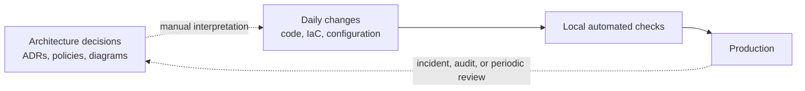
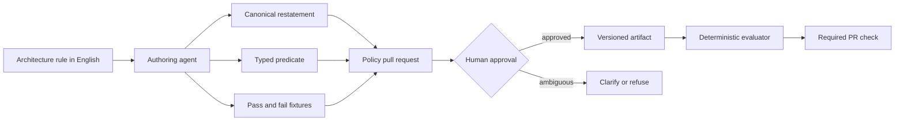
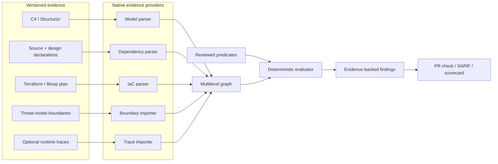

# Enterprise Architecture Governance: Problem Brief

This document starts with the enterprise problem before choosing a product or implementation.
The core question is not "how can AI review architecture?" It is:

> **How can an enterprise keep thousands of daily software changes aligned with architecture
> decisions that are distributed across teams, repositories, documents, and review boards?**

## Enterprise context

Large organizations rarely have one application, one repository, or one architecture owner.
They operate hundreds of services across multiple business domains, clouds, technology stacks,
and delivery teams. A single customer journey can cross systems owned by many teams, while each
team sees only its local part of the system.

The architecture is represented in several incomplete forms:

- diagrams describe the intended system,
- ADRs explain selected past decisions,
- source code contains actual software dependencies,
- infrastructure as code describes proposed deployment topology,
- cloud environments contain deployed topology,
- runtime traces reveal which relationships are actually exercised,
- policies live in standards, wikis, tickets, and senior engineers' memories.

No representation is complete, and they change at different speeds. The enterprise therefore
cannot answer a basic question reliably: **does the system being changed still conform to the
architecture the organization approved?**

## Who experiences the problem

| Stakeholder | What they are trying to do | What gets in the way |
|---|---|---|
| Developer | Deliver a change safely and quickly | Relevant architecture rules are hard to discover and often learned only during review |
| Team lead | Keep delivery moving without accumulating hidden coupling | Local changes can create system-wide consequences that team-level tests do not expose |
| Architect | Preserve boundaries and long-term evolvability | Review capacity does not scale with the number and speed of changes |
| Platform team | Provide safe paths and reusable controls | Standards are documented, but adoption and exceptions are difficult to observe |
| Security and compliance | Prove required boundaries remain intact | Evidence is assembled manually and point-in-time models become stale |
| Engineering leader | Understand architecture risk and investment needs | There is no consistent view of drift, exceptions, recurring violations, or ownership |

This is a two-sided operational problem. Developers lack timely architecture context, while
architects lack a scalable enforcement and feedback mechanism.

## How governance works today

A typical enterprise architecture process looks like this:

1. A project presents a design to an Architecture Review Board (ARB).
2. The board records decisions in diagrams, documents, tickets, or ADRs.
3. Delivery is split across teams and repositories.
4. Hundreds of later pull requests implement and evolve the design.
5. Code review, unit tests, security scans, and IaC checks validate their own narrow concerns.
6. Architecture is reviewed again only for a major initiative, audit, incident, or escalation.

The control is strongest at design approval and weakest during everyday implementation, exactly
when the largest number of architecture-affecting decisions are made.

## The five core enterprise problems

### 1. Architecture review is manual

Architects manually compare designs and pull requests with standards spread across diagrams,
wikis, ADRs, and institutional knowledge. This work is slow, subjective, and constrained by a
small number of senior people who cannot inspect every change in every repository.

**Consequence:** architects become delivery bottlenecks, while unreviewed changes can violate
important boundaries without detection.

### 2. Architecture is reviewed only at project or feature inception

Most reviews happen when a project or major feature is proposed. The design may be valid when the
board approves it, but implementation continues through hundreds of later pull requests. Scope,
dependencies, infrastructure, and ownership evolve after that approval.

**Consequence:** approval is a point-in-time snapshot, not evidence that the delivered system
still follows the approved architecture.

### 3. There is no continuous architecture review

Enterprises automate tests, security scans, code-quality checks, and infrastructure validation on
every pull request, while architecture decisions remain outside the continuous-delivery loop.
Rules such as "services must not share databases" are understandable to people but invisible to a
normal build. Code, IaC, and runtime behavior can each be valid in isolation while contradicting
the approved design.

**Consequence:** architecture drift accumulates silently and is discovered during a later review,
audit, dependency exercise, or incident, when remediation is much more expensive.

### 4. Developers cannot automatically check central architecture guidance

Developers have no self-service way to check a proposed change against the effective combination
of organization, domain, team, and service rules. They must find documents, ask an architect, or
wait for review. Policies and exceptions overlap, so it is often unclear which rule applies, who
owns it, why it exists, or whether an exception remains valid.

**Consequence:** teams interpret the same guidance differently, learn constraints late, and make
locally convenient choices that create enterprise-wide coupling and risk.

### 5. AI-generated pull requests increase the HLD and LLD review gap

AI coding agents generate implementations and pull requests faster than people can review them.
Conventional automation checks code correctness, style, tests, and known security patterns, but it
does not reliably determine whether a change preserves low-level design (LLD) rules such as
layering and dependency inversion, or high-level design (HLD) rules such as service boundaries,
ownership, communication modes, and deployment topology.

A generated change can compile, pass tests, and be locally correct while introducing a forbidden
dependency or contradicting an approved architecture decision.

**Consequence:** implementation throughput rises while architecture-review capacity stays fixed,
widening the control gap and increasing the chance that structurally harmful changes reach
production.

## Why existing controls do not close the gap

- Linters check syntax and local coding conventions.
- Static security tools detect code-level vulnerability patterns.
- Architecture-test libraries enforce rules specialists have already encoded in code.
- IaC tools check resource configuration and compliance.
- Modeling tools validate a model's syntax and internal consistency.
- AI reviewers offer useful interpretation, but a new model judgment on every run is difficult to
  reproduce, audit, appeal, or trust as a required enterprise control.

Each control can work correctly while a change still violates an enterprise architecture
decision. Temporary exceptions create another gap: they are often recorded in a ticket or meeting
note, lose their owner, outlive their expiry, and become permanent architecture debt.

## Concrete enterprise scenario

Consider an enterprise checkout flow spanning Orders, Payments, Customer Profile, Inventory, and
Analytics. The approved architecture keeps Payments available when Customer Profile is degraded:
profile data reaches Checkout through an event-fed local projection.

A developer needs one additional profile field. A direct API call is easy to implement, passes
unit tests, passes security scanning, and looks reasonable in code review. It also creates a new
runtime dependency in a revenue-critical path. Customer Profile latency and outages can now stop
checkout, and the Payments team can no longer deploy or test independently.

The mistake is not a syntax error, vulnerability, or invalid cloud resource. It is a violation of
an architectural decision. The organization usually discovers it during a later design review,
load test, production incident, or dependency-mapping exercise.

## Enterprise impact

The consequences compound rather than appearing as one obvious failure:

- **Slower delivery:** coupled teams must coordinate releases and wait for cross-team reviews.
- **Lower reliability:** undeclared dependencies enlarge failure domains and surprise responders.
- **Higher change cost:** late remediation requires migrations and multi-team programs.
- **Compliance exposure:** approved boundaries and data-handling decisions may no longer match
	deployed reality.
- **Knowledge concentration:** a few architects become bottlenecks because policy lives in their
	memory and judgment.
- **Poor auditability:** the organization cannot easily show which rule was evaluated, against
	which evidence, for a particular change.
- **Architecture debt:** temporary shortcuts become structural constraints with no owner or exit
	date.

Avoid invented savings percentages in the pitch. The strongest evidence will be concrete internal
examples: late ARB findings, incidents caused by hidden dependencies, exception age, review wait
time, and remediation effort.

## Root cause

The root cause is not that enterprises lack architecture documents or review tools. It is that
**architecture intent is disconnected from continuous delivery evidence**.



The dashed links are slow, manual, and lossy. Enterprises need continuity between the decision,
the implementation evidence, the exception process, and the feedback delivered to a developer.

## Problem statement

> Enterprises cannot continuously verify that code and infrastructure changes conform to approved
> architecture decisions. The decisions are human-readable but not executable, evidence is split
> across incompatible artifacts, and central review does not scale to pull-request velocity. As a
> result, violations are discovered late, architecture drifts from reality, and temporary
> exceptions become permanent debt.

## What a valid solution must achieve

This is not yet a product design. These are problem-derived requirements any credible solution
must satisfy:

1. Meet developers inside the normal delivery workflow, before merge.
2. Preserve the exact human intent and ownership behind a rule.
3. Evaluate system-wide relationships, not only changed lines in one repository.
4. Connect evidence across design, source, infrastructure, and eventually runtime behavior.
5. Produce reproducible decisions suitable for audit and appeal.
6. Distinguish violation, insufficient evidence, tool failure, and approved exception.
7. Support organization-wide requirements without erasing domain and team context.
8. Make temporary exceptions visible, owned, and self-expiring.
9. Explain findings in terms of architectural risk and a viable design move.
10. Route genuine trade-offs to people rather than pretending all architecture is automatable.

## Assumptions to validate

Before fixing the hackathon scope, interview architects, platform teams, and developers to test:

1. Which architecture violations recur most often and are expensive enough to matter?
2. At what stage are they currently discovered?
3. Where are the governing decisions recorded today?
4. Which evidence sources are both available and trusted?
5. Which decisions are objective enough to automate, and which require judgment?
6. Would teams accept a blocking check? Under what confidence and exception conditions?
7. How often do diagrams, IaC, and runtime behavior disagree?
8. What makes a developer accept or ignore an architecture finding?
9. How are temporary exceptions approved, tracked, and retired today?
10. Which metric best demonstrates value: review time, escaped violations, remediation effort,
		exception age, incident contribution, or release coordination?

## Scope boundary

This problem is specifically about architecture governance: component placement, dependency
direction, ownership, boundaries, communication modes, deployment topology, and traceability to
decisions. It is not a replacement for vulnerability scanning, secret detection, code quality,
dependency vulnerability management, formatting, or general AI code review.

## Product hypothesis

> **ArchGuard-AI turns architecture rules written in plain English into reviewed, versioned,
> deterministic fitness functions that evaluate every pull request against code structure,
> declared design, and planned infrastructure.**

**The model proposes at authoring time. The fitness function decides at runtime.**

The working name must change before public release. An established open-source architecture
governance project and a GitHub Marketplace AI reviewer already use ArchGuard.

## One engine, two policy packs

| Policy pack | Scope | Representative rules |
|---|---|---|
| **Design Rules** | LLD inside a service: modules, types, ports, layers, aggregates | Layer direction, dependency inversion, cycles, data-access placement, module ownership |
| **Fitness Functions** | HLD between services and deployment resources | Domain isolation, communication mode, datastore ownership, trust boundaries, C4-to-IaC drift |

These are views over one multilevel graph, not separate products. They share one rule format,
compiler, evaluator, exception path, and report surface. A single finding can therefore connect a
high-level architecture decision to the low-level dependency that violates it.

## Core mechanism: compile once, replay everywhere



1. An architect or team writes a rule in plain English.
2. An agent compiles it into a canonical restatement, a declarative predicate, and fixtures.
3. A human reviews the interpretation as a policy pull request.
4. The approved artifact is committed with its semantic dependencies pinned.
5. Every later pull request replays the predicate without a model in the decision path.
6. Unsupported or ambiguous rules return `CLARIFY`; they never become accidental blockers.

The compiler targets a closed predicate vocabulary rather than generating free-form executable
tests. Hand-written, tested renderers can translate predicates to mature tools such as ArchUnit,
import-linter, dependency-cruiser, or a topology matcher. This prevents hallucinated APIs,
generated-code execution risks, and expansion into a general static analyzer.

## Architecture and evidence



Native parsers provide facts; the product does not build new language frontends. Each provider
publishes its capabilities and blind spots. Static evidence cannot reliably observe reflection,
dynamic dispatch, generated wiring, or every runtime call, so absence of evidence never becomes
proof of compliance.

## Rule governance

Rules may be owned at regulatory, organization, domain, team, or service scope. Higher-tier rules
remain active conjunctively; lower tiers add constraints instead of replacing them. Relaxation
requires an approved, expiring exception linked to an ADR.

```yaml
id: PAY-014
title: Checkout must not synchronously depend on customer profile
tier: team
owner: payments
scope: ["tag:payments", "container:Checkout API"]
type: structural
severity: high
mode: blocking
evidence: architecture-model
review_by: 2026-12-31
body: >
  During checkout, payment systems must not synchronously call a customer profile
  service. Required profile data must come from a locally owned event projection.
```

`CODEOWNERS` protects rule and declaration ownership. A feature author cannot evade a rule by
silently relabeling a component, removing a stereotype, or redrawing an edge. Classification
changes are governance events and require the architecture owner's review.

## Evaluation semantics

Architecture meaning is graph-global, so evaluation is not limited to changed lines:

1. Build the complete graph for the base commit.
2. Build the complete graph for the proposed head commit.
3. Replay every applicable predicate over both graphs.
4. Block only on findings introduced at head.
5. Report pre-existing findings as recorded debt.
6. Re-evaluate at merge-queue head to catch interactions between concurrent pull requests.

Every rule resolves to one of five verdicts:

| Verdict | Meaning | Gate behavior |
|---|---|---|
| `PASS` | Evaluated with no violation | Proceed |
| `FAIL` | Violation found | Block when policy mode requires it |
| `UNKNOWN` | Evidence is missing or insufficient | Never treat as pass |
| `ERROR` | Provider, parse, or binding failed | Fail the check rather than silently turn green |
| `SKIPPED` | Out of scope, superseded, or covered by a live exception | Report the exact reason |

A selector matching no elements is `UNKNOWN`, not `PASS`. Compiled rules pin the source text,
primitive semantics, graph schema, declaration bindings, and provider capabilities. Relevant
changes trigger revalidation and, when meaning may change, human re-approval.

## What may block

Only observable, high-confidence structural facts may block a pull request.

| Rule family | Treatment |
|---|---|
| Layer direction, allowed dependencies, cycles, placement, ownership | May block |
| C4 intent versus an unambiguous IaC-plan relationship | May block |
| Coupling budgets and structural SOLID proxies | May block only when explicitly labeled as proxies |
| Semantic compatibility, Liskov substitution, resilience effectiveness | Advisory only |
| Latency, cost, error budgets, and other external metrics | Trend only |
| Architectural trade-offs and taste | Route to the human review board |

The boundary is simple: if the fix changes **where code lives or who may talk to whom**, it
belongs here. If it changes **what a line does**, it belongs in CodeQL, a linter, a security
scanner, or another specialist tool.

## Product experience

### Pull-request architecture review

A PR that makes `Order API` call `Inventory Database` directly receives a failed check containing
the violated policy in its authors' words, affected components, full graph path, `file:line`
evidence, resolution trace, and a safer design move such as an event-backed projection.

### Intent-versus-reality drift radar

Compare C4 intent with Terraform or Bicep planned topology. If the model declares an event flow
but the plan introduces a direct database path, report the undeclared path. A scheduled extension
can compare against live infrastructure. An OpenTelemetry provider can add observed runtime calls:
"the diagram says asynchronous; production recorded 4,102 synchronous calls."

### Policy authoring playground

Architects edit a rule, inspect its restatement and fixtures, and test it against prepared clean
and broken architectures before opening the policy PR. Unsupported input produces a clarifying
question rather than a plausible guess.

### Remediation and architecture questions

The agent explains findings and proposes constrained design moves: move, invert, split, introduce
an abstraction, or decouple. An IDE or PR assistant can answer "may Orders call Payments
directly?" by querying the same approved predicates used by CI.

### Living decisions and scorecards

Findings roll up by team, domain, severity, exception age, and recurring policy. Rules link to the
ADRs that justify them; reports expose accepted ADRs with no enforcing rule and rules with no
recorded rationale. Scorecards report actionable risk and trends, never a vague quality score.

### Threat-model bridge

Existing threat models are inputs, not competitors. Imported trust boundaries annotate the graph.
When a PR creates a new crossing, the product marks the threat model stale and requests security
review. It does not claim to generate threats or replace STRIDE analysis.

## Competitive position

| Existing approach | What it does | Remaining gap |
|---|---|---|
| ArchUnit, NetArchTest, import-linter | Deterministic code-level architecture tests | Rules require specialist code and usually stop at one repository |
| Structurizr and C4 tooling | Versioned architecture models | No organization-specific PR enforcement |
| OPA, Checkov, tfsec | Policy and IaC compliance | No architecture-intent graph or design-boundary semantics |
| Generic AI review agents and skills | Re-read prose and judge each PR | Re-decide every run; difficult to test, diff, govern, or reproduce |
| Threat-modeling tools | Analyze security threats in a modeled design | Do not enforce broad architecture policy or detect model staleness |

The defensible novelty claim is:

> Architecture rules written in English, compiled once into reviewed and version-controlled
> predicates, then replayed deterministically over one graph spanning code structure, declared
> architecture, and deployment topology, with no model in the gate decision.

A skill can invoke this system and explain its output, but it is not a substitute for the governed
artifact. A skill re-decides; this product replays.

## Hackathon MVP

Build and demonstrate only the shortest convincing path:

1. One plain-English payments rule plus one deliberately ambiguous rule.
2. The agent emits a restatement, predicate, and pass/fail fixtures.
3. The ambiguous rule is refused with a clarifying question.
4. A human approves the clear predicate in a policy pull request.
5. A second PR introduces a forbidden dependency and is blocked with an annotated graph.
6. The check is rerun with the model unavailable and produces identical output.
7. As a second act, an IaC plan or captured trace reveals a path absent from the C4 model.

Do not spend the demo explaining the full tier hierarchy, all rule families, dashboards, or
exception mechanics. Those establish depth in the written submission. The live story is:

> English rule -> reviewed predicate -> blocked dependency -> deterministic rerun -> drift reveal.

## Three-minute demo

**0:00-0:30 - Pain.** A developer adds a reasonable shortcut because the architecture rule lives
in a document they never saw.

**0:30-1:15 - Author.** Show the English rule becoming a five-line predicate and two fixtures.
Show the agent refuse the ambiguous rule. Approve the clear interpretation.

**1:15-2:10 - Enforce.** Open the violating PR. The check draws the offending edge, quotes the
team's rule, and suggests the approved event path.

**2:10-2:40 - Prove.** Disable the model and rerun. The result is identical because CI replays the
artifact rather than asking for another opinion.

**2:40-3:00 - Expand.** Reveal a C4-to-IaC or C4-to-runtime mismatch and close with continuous
architecture review across design, deployment, and reality.

## Build plan

| Workstream | Deliverable |
|---|---|
| Authoring agent | Compile a narrow English vocabulary; restate, generate fixtures, clarify, refuse |
| Engine | Build base/head graphs and evaluate a small closed predicate set |
| Evidence | Parse one dependency format, one C4 sample, and one IaC plan or trace fixture |
| Pipeline | Publish a required GitHub check and markdown/SARIF finding |
| UI | Show policy authoring and an annotated before/after graph |
| Pitch | Rehearse one failure story, deterministic rerun, and competitive answer |

## Roadmap

1. Detect contradictory, redundant, dead, and uncovered rules: a linter for governance.
2. Publish per-repository evidence and compose an organization-wide polyrepo graph.
3. Bind accepted ADRs to enforcing rules in both directions.
4. Add scheduled live-infrastructure and runtime-trace drift sweeps.
5. Add team and organization scorecards, exception registers, and rule-health reports.
6. Offer an IDE architecture oracle backed by the deterministic engine.
7. Explore FinOps and GreenOps fitness functions over infrastructure evidence.

## Risks and mitigations

| Risk | Mitigation |
|---|---|
| Compilation misinterprets policy | Human review, restatement, fixtures, `CLARIFY`, and refusal |
| Fixtures repeat the model's misunderstanding | Treat fixtures as evidence, never a replacement for review |
| A rule silently stops matching | Selector cardinality, `UNKNOWN`, dependency pinning, vacuous-rule reports |
| Noisy checks destroy developer trust | Advisory-first adoption; demotion only through a reviewed policy PR |
| Legacy systems start with many violations | Gate only on new finding-set deltas and track the baseline as debt |
| Scope expands into lint or security scanning | Closed structural vocabulary and explicit non-goals |
| Evidence misses dynamic behavior | Publish provider limits and add runtime evidence without treating absence as proof |
| The product appears to automate judgment | Route holistic trade-offs to people with an evidence-backed review packet |
| The name collides with existing products | Rename before submission and cite prior art honestly |

## Success measures

- High-severity architecture violations blocked before merge.
- False-positive, `UNKNOWN`, and vacuously-true rates per rule.
- Reduction in manual architecture-review pull requests.
- Exception count and mean age to expiry.
- Recorded architecture debt burn-down by team.
- Share of rules reused from a starter catalog.
- C4-to-IaC and C4-to-runtime drift detected.

## Open decisions

1. Choose the public product name.
2. Choose the first design-language provider: Java/Kotlin with ArchUnit, C# with Roslyn, or
   TypeScript with dependency-cruiser.
3. Choose the second-act evidence: Terraform plan for planned drift or OpenTelemetry fixture for
   observed drift.
4. Decide whether the first release is advisory-first or blocks one narrow, high-confidence rule.
5. Decide whether service scope maps to a repository or a service within a monorepo.

## References

- C4 model: https://c4model.com/
- Structurizr as code: https://docs.structurizr.com/as-code
- Architecture fitness functions: https://martinfowler.com/bliki/ArchitectureFitnessFunction.html
- GitHub required status checks: https://docs.github.com/en/repositories/configuring-branches-and-merges-in-your-repository/managing-protected-branches/about-protected-branches
- GitHub CODEOWNERS: https://docs.github.com/en/repositories/managing-your-repositorys-settings-and-features/customizing-your-repository/about-code-owners
- Microsoft Threat Modeling Tool: https://learn.microsoft.com/en-us/azure/security/develop/threat-modeling-tool
- import-linter: https://github.com/seddonym/import-linter
- pytest-archon: https://github.com/jwbargsten/pytest-archon
- Prose2Policy research: https://arxiv.org/abs/2603.15799
- Thoughtworks ArchGuard prior art: https://github.com/archguard/archguard
- ArchGuard AI Reviewer name collision: https://github.com/archguard-labs/action
