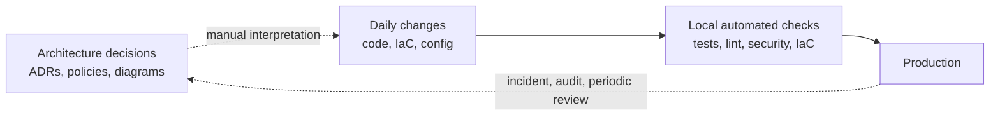
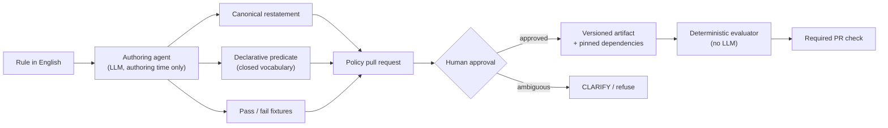
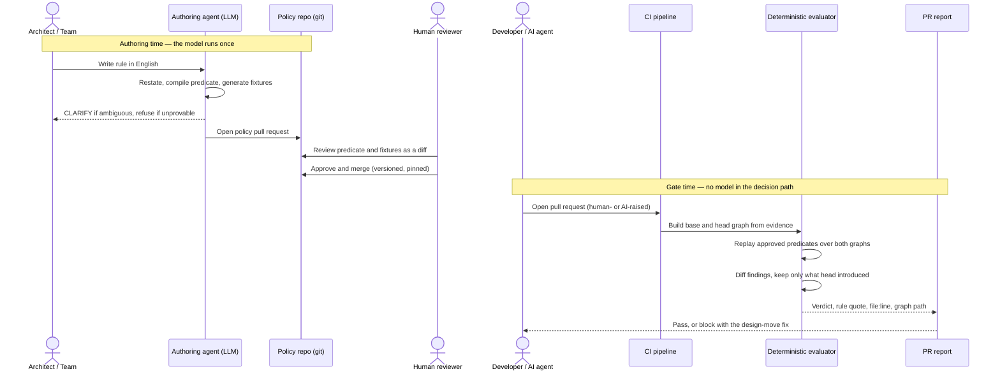
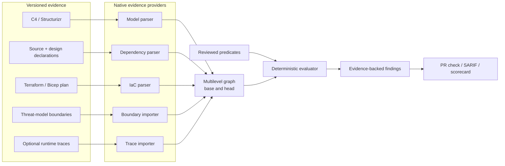
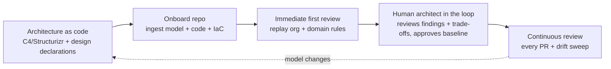

# ArchGuard — Continuous Architecture Governance

A single design document: problem, evidence, prior art, solution, detailed design,
differentiation, and how to present it. Working name is `ArchGuard`; see
[Open decisions](#13-open-decisions) for the required rename.

---

## 1. Executive summary

Enterprises approve an architecture once, then change it through thousands of pull requests that
no one reviews for architectural intent. Code review, tests, security scanners, and IaC checks
each validate a narrow concern; none answer the question *"does this change still conform to the
architecture we approved?"* The result is silent architecture drift, discovered late in audits,
load tests, or incidents, when it is expensive to reverse. In the AI era — when code is
increasingly written *and* reviewed by AI agents — an independent, deterministic architecture
check on every pull request stops being a nice-to-have and becomes the missing control.

ArchGuard makes architecture rules executable. An architect writes a rule in plain English; an
agent compiles it **once**, at authoring time, into a reviewed, version-controlled predicate; and
every pull request thereafter is evaluated **deterministically** against that predicate, with no
model in the decision path. Rules run over one multilevel graph assembled from code, the
C4/Structurizr model, and the infrastructure plan — so the same rule can check what was
*designed*, what is *built*, and what is *deployed*.

- **Value proposition:** continuous, deterministic architecture review on every change, in the
  pull request, in the team's own words.
- **Primary users:** architects and platform teams (author and own rules), developers (feedback
  before merge), engineering leaders (drift and risk visibility).
- **One-line claim:** *English rule in, reviewed predicate out, replayed on every PR — governance
  you can test, diff, version, and block a merge on.*

---

## 2. Problem statement

> **Enterprises cannot continuously verify that code and infrastructure changes conform to the
> architecture they approved.** Architecture decisions are human-readable but not executable, the
> evidence needed to check them is split across code, models, and infrastructure, and central
> review does not scale to pull-request velocity. Violations are found late, architecture drifts
> from reality, and temporary exceptions become permanent debt.

### 2.1 Context

A large organization runs hundreds of services across multiple domains, teams, clouds, and
stacks. Its architecture is represented in several incomplete, independently changing forms:
diagrams, ADRs, source code, infrastructure as code, deployed cloud topology, runtime traces, and
policies in wikis and people's heads. No single representation is authoritative or complete, so
the organization cannot reliably answer whether a given change still matches the approved design.

### 2.2 The five core problems

1. **Architecture review is manual.** Architects compare designs and PRs against standards spread
   across documents and memory. The work is slow, subjective, and gated by a few senior people.
   *Consequence:* architects become bottlenecks and most changes are never reviewed for
   architecture.

2. **Architecture is reviewed only at project or feature inception.** Approval happens once, at
   kickoff or a design board. Implementation then continues through hundreds of later PRs that
   change scope, dependencies, topology, and ownership. *Consequence:* approval is a point-in-time
   snapshot, not evidence that the delivered system still follows the design.

3. **There is no continuous architecture review.** Tests, security, code quality, and IaC run on
   every PR; architecture does not. Rules like "services must not share a database" are clear to
   people but invisible to the build. *Consequence:* drift accumulates silently and surfaces in a
   later audit or incident, when remediation is costly.

4. **Developers cannot self-check central architecture guidance.** There is no automated way to
   test a change against the effective org + domain + team + service rules. Developers must find
   documents, ask an architect, or wait for review; overlapping policies and exceptions make it
   unclear which rule applies or why. *Consequence:* teams interpret guidance differently and make
   locally convenient choices that create system-wide coupling.

5. **AI now writes the code and reviews it — with no independent architecture check.** AI coding
   agents open pull requests faster than people can review them, and AI reviewers are increasingly
   asked to approve those same changes. When the author and the reviewer are both models, nothing
   independently verifies that the change preserves low-level design (layering, dependency
   inversion) or high-level design (service boundaries, ownership, communication mode, topology).
   Conventional automation checks correctness, style, tests, and known vulnerabilities — not
   architecture — so a change can compile, pass tests, be AI-approved, and still introduce a
   forbidden dependency. The developer clicking merge cannot be sure an AI-raised PR aligns with
   the approved architecture. *Consequence:* implementation throughput rises while independent
   architecture review stays flat or vanishes, and structurally harmful changes reach production
   inside an author-plus-reviewer loop that no human audited.

**Why now — the AI era.** When code is both authored and reviewed by AI, the last trustworthy
control is a deterministic, independent architecture check that runs on every pull request —
human- or agent-raised — and returns the same verdict every time. Continuous architecture review
therefore shifts from a maturity goal to a necessary counterweight to automated code generation:
the faster code is generated, the more it matters that something reproducible is checking its
shape.

**Developer pain points.** The cost is felt most acutely by the developer trying to ship:

- **Rules are tribal knowledge.** A developer often learns a boundary exists only when a reviewer
  objects — days after the code is written, tested, and mentally "done."
- **No fast "am I allowed to do this?" answer.** There is no local, self-service way to check a
  design choice *before* writing the code, so the safe move is to guess and hope review agrees.
- **Feedback is late and manual.** A PR can wait hours or days for an architect, blocking the
  merge and forcing a context switch onto other work.
- **Rework is expensive and demoralizing.** Architecture objections arrive after implementation,
  so the fix is a redesign, not a tweak.
- **Verdicts are inconsistent.** Two reviewers — or two AI review runs — give different answers to
  the same question, so the rule feels arbitrary and trust erodes.
- **Merged today, reverted later.** A change passes review, then a periodic sweep or incident
  forces a costly rollback the developer thought was already behind them.
- **Onboarding is slow.** New engineers need months to absorb unwritten architecture constraints
  that live in senior engineers' heads.

**Where the time goes — a slow process.** The workflow serializes architecture decisions through
scarce people and scheduled events:

- **Design approval is a scheduled meeting.** An ARB slot may be days or weeks out, so work either
  waits or proceeds at risk.
- **Reviews queue behind a bottleneck.** Architecture feedback funnels through a few senior
  reviewers and is handled serially.
- **Exceptions require chasing an approver.** There is no self-service, time-boxed exception path,
  so a legitimate deviation stalls the change.
- **Drift is found by audits or incidents.** The slowest, most expensive feedback loop of all is
  the one most organizations rely on today.

### 2.3 Concrete scenario

A checkout flow spans Orders, Payments, Customer Profile, Inventory, and Analytics. The approved
architecture keeps Payments available when Customer Profile is degraded: profile data reaches
Checkout through an event-fed local projection. A developer needs one more profile field and adds
a direct synchronous API call. It compiles, passes unit tests, passes security scanning, and looks
fine in code review. It also puts Customer Profile in the revenue-critical path — its latency and
outages now stop checkout, and Payments can no longer deploy independently. The defect is not a
bug or a vulnerability; it is a violation of an architecture decision, usually found only in a
later design review, load test, or incident.

### 2.4 Business impact

Architecture drift is rarely one dramatic failure; it is a compounding tax paid in lost time, lost
money, and lost customer trust.

- **One wrong architectural decision can cause an outage.** A single undeclared dependency in a
  revenue-critical path — a synchronous call into a service meant to stay isolated — turns that
  service's next slowdown into a checkout outage. The blast radius is fixed at design time; the
  bill arrives in production, usually at peak load.
- **Lost customer value and trust.** Outages and degraded flows hit customers directly: failed
  checkouts, abandoned carts, broken sign-ins. Churn, refunds, and reputation damage outlast the
  incident and cost far more than the fix would have.
- **Lost money.** Every hour of downtime in a transactional system is direct lost revenue, and
  late architectural remediation is the most expensive engineering there is — data migrations, API
  redesigns, and coordinated multi-team programs instead of a one-line change at review time.
- **Lost time and velocity.** Coupled teams synchronize releases, wait in cross-team review
  queues, and re-plan around dependencies they never intended. Delivery slows across every team
  the coupling touches, not only the one that caused it.
- **Compliance and audit exposure.** When deployed reality drifts from approved boundaries and
  data-handling decisions, the organization carries regulatory risk and cannot cheaply prove which
  rule was checked against which evidence.
- **Key-person risk.** Architecture that lives in a few senior heads makes those people
  bottlenecks and single points of failure for every non-trivial change.
- **Architecture debt.** Temporary shortcuts with no owner or expiry harden into permanent
  constraints that make the whole system slower and riskier to change.

The through-line: the cheapest place to catch an architecture violation is the pull request. Every
later stage — review, staging, audit, incident — multiplies the cost in time, money, and customer
trust.

### 2.5 Root cause

Architecture *intent* is disconnected from continuous delivery *evidence*.



The dashed links are slow, manual, and lossy. The organization needs a continuous, automated link
from decision to change to feedback.

### 2.6 Scope

ArchGuard governs **architecture**: component placement, dependency direction, ownership,
boundaries, communication mode, deployment topology, and traceability to decisions. It is **not**
vulnerability scanning, secret detection, code-quality linting, dependency-CVE management,
formatting, or general AI code review. It consumes those tools' outputs as evidence where useful
and never re-implements them.

The impact is measurable, and the same signals become the product's success metrics (§12):
recurring violations, the stage at which violations are caught, review queue time, the share of
pull requests actually reviewed for architecture, and the age of open exceptions.

---

## 3. Is this already implemented? (Prior art)

Short answer: **pieces exist; the full loop does not.** The two halves of the claim — *compile
English into a reviewed, versioned architecture predicate* and *evaluate one graph spanning code
and deployed topology* — are each partially present elsewhere, but not combined.

| Category | Representative tools | What they do | Gap they leave |
|---|---|---|---|
| Architecture tests as code | ArchUnit, ArchUnitNET, ts-arch, NetArchTest, Konsist, deptrac, import-linter, dependency-cruiser | Deterministic structural rules | Rules hand-written in code by a specialist; usually one repository; no C4/IaC awareness |
| C4 as code | Structurizr, C4 tooling | Versioned architecture models | No org-specific enforcement on a PR |
| Policy / IaC compliance | OPA, Checkov, tfsec | Config and policy-as-code | No architecture-intent graph or design-boundary semantics |
| Infra drift | Terraform Cloud, Spacelift, env0 | Live vs. state-file drift | Not model-vs-infrastructure architecture drift |
| AI PR reviewers with a rules file | CodeRabbit, Cursor rules, a Marketplace "AI architecture reviewer" | Re-read prose rules and judge each PR | Re-decide every run; not reproducible, testable, diffable, or a trustworthy required check |
| Threat modeling | Microsoft TMT, IriusRisk, OWASP Threat Dragon | Security threats over a modeled design | Security-scoped; point-in-time; no broad architecture policy; no model-staleness gate |

**Name collision (must resolve).** An established open-source architecture-governance project and
a GitHub Marketplace "AI architecture reviewer" both already use the name *ArchGuard*. The latter
also reads a plain-text rules file and judges PRs with an LLM — exactly the re-decide-every-run
design this document argues against, and it also drifts into security/lint checks. This both
proves demand and demonstrates the two failure modes we avoid.

**Nearest research.** *Prose2Policy*-style work (an LLM compiles natural-language policy into a
formal language with generated tests) is the closest published mechanism, in a different domain
(access control). Its reported positive-test pass rate (~82%) is the key number: roughly one
compiled policy in six failed its own generated tests. That is why human review, `UNKNOWN`, and
refusal are load-bearing here, not decoration.

**Unoccupied space:** declared C4 model vs. planned IaC topology, and English compiled once into a
reviewed, versioned architecture predicate replayed with no model at gate time.

---

## 4. Product hypothesis and approach

> **Turn architecture rules written in plain English into reviewed, versioned, deterministic
> fitness functions that evaluate every pull request against code structure, declared design, and
> planned infrastructure.**
>
> **The model proposes at authoring time. The fitness function decides at runtime.**

### 4.1 One engine, two policy packs

| Pack | Altitude | Scope | Example rules |
|---|---|---|---|
| **Design Rules** | Low-level design, inside a service | modules, types, ports, layers, aggregates | layer direction, dependency inversion, no cycles, data-access placement, module ownership |
| **Fitness Functions** | High-level architecture, between services | systems, containers, boundaries, topology | domain isolation, sync vs. async, datastore ownership, trust boundaries, C4-vs-IaC drift |

They are views over **one multilevel graph**, sharing one rule format, compiler, evaluator,
exception path, and report surface — not two products. A single finding can therefore link a
high-level decision to the low-level dependency that violates it.

The two packs are the starting catalog, not the ceiling. The same compile-once-replay engine can
enforce any architecture characteristic that leaves observable evidence.

### 4.1.1 What else we can automate

Neal Ford and Mark Richards frame architecture governance as **fitness functions** over
**architecture characteristics** (the "-ilities") — an objective measure that protects a
characteristic as the system evolves (*Building Evolutionary Architectures*; *Fundamentals of
Software Architecture*; *Software Architecture: The Hard Parts*). ArchGuard is a practical home for
that idea: each rule below is a fitness function compiled once and replayed on every pull request.
Their taxonomy maps directly onto the engine — **atomic vs. holistic** (one element vs. a
combination), **triggered vs. continuous** (per-PR vs. scheduled or telemetry-driven), and
**static vs. dynamic** (structure/plan vs. runtime behavior).

| Candidate fitness function | What it protects | Evidence | Gate status |
|---|---|---|---|
| **Static coupling / connascence** | Modularity; how strongly elements are bound | Dependency graph | May block on new strong coupling |
| **Dynamic coupling** (sync depth, fan-out on a request path) | Resilience; blast radius | C4 + traces | Trend; block only on sync-into-isolated |
| **Service granularity / quantum** | Independent deployability of a context | Graph + ownership | Advisory + trend |
| **No distributed transaction across services** | Consistency boundaries | Graph + IaC | May block |
| **Saga / orchestration boundary placement** | Workflow ownership | Declarations + graph | May block |
| **Consumer-driven contract compatibility** | Evolvability; no breaking API change | Contract + schema diff | May block on breaking change |
| **Event-schema governance** (versioning, no field removal) | Backward compatibility | Schema-registry diff | May block |
| **Data ownership / no shared database** | Domain isolation | Graph + IaC | May block |
| **Testability** (unit tests never touch infrastructure) | Feedback speed | Test graph | May block |
| **Observability floor** (every service emits trace/metric) | Operability | Declarations + telemetry | Advisory |
| **Scalability / elasticity** | Cost under load | Metrics | Trend only |
| **Trust-boundary integrity** (no unencrypted crossing) | Security posture | Threat-model + graph | May block |
| **Threat-model staleness** | Security currency | Boundaries + diff | Advisory, opt-in block |
| **FinOps / GreenOps** (no new cross-AZ hot-path transfer) | Cost / carbon | IaC plan | Advisory + trend |
| **Documentation currency** (ADR exists; diagram matches code) | Auditability | ADRs + graph | Advisory |

Every row is the same shape: a declared characteristic, an evidence provider, a closed-vocabulary
predicate, and a gate status governed by the capability matrix (§4.7). New families are added by
extending the renderer and the catalog, never by generating free-form code.

### 4.1.2 Worked example: a retail organization

A mid-to-large retailer ("NorthPeak Retail") runs web, mobile, stores, and fulfillment on a few
hundred services. A realistic org, and the rule each team would own:

| Tier | Team | Sub-teams | Example architecture rule they own |
|---|---|---|---|
| **T0 Vista Retail** | Retail | retail compnay | Cardholder data (PAN) may live only inside the `pci` trust boundary; nothing outside it may depend on a service that stores PAN |
| **T1 Org** | Enterprise Architecture | Platform standards, API governance | No service may share another domain's database; every cross-domain call goes through a published API or event |
| **T2 Domain** | Checkout & Payments | Cart, Checkout, Payments, Fraud | Checkout must not synchronously depend on Customer Profile; payment authorization must cross the `PaymentGateway` port |
| **T2 Domain** | Catalog & Search | Product, Pricing, Search, Recommendations | Pricing is the only writer of the price store; Search reads the catalog projection, never the product DB |
| **T2 Domain** | Order & Fulfillment | Orders, Inventory, Warehouse, Shipping | Inventory owns stock; Orders may reserve stock only via the Inventory API, never a direct DB read |
| **T2 Domain** | Customer | Profile, Identity, Loyalty, Notifications | Identity is the only issuer of auth tokens; Loyalty consumes profile changes as events |
| **T3 Team** | Storefront | Web, Mobile BFF, CMS | BFFs may call domain APIs but not each other; the web app must not call a domain service directly |
| **T3 Team** | Data & Analytics | Streaming, Warehouse, ML | Analytics is read-only on operational data; no analytics service sits in a checkout request path |
| **T4 Service** | `payments-service` owners | — | Raw SQL may appear only in repository adapters; the domain layer depends only on ports |

**One rule, two levels, one graph.** The org rule "no shared database across domains" (T1) and the
payments team's design rule "the domain layer may depend only on ports" (T4) compile to the same
predicate language and evaluate on the same graph. A single Black-Friday PR that adds a direct read
from Orders into the Inventory database fails the T1 fitness function (domain isolation) and, if it
also bypasses the repository port, the T4 design rule — both findings on one check, each quoting
the owning team's own words.

### 4.2 Core mechanism: compile once, replay everywhere



An English sentence is compiled once into a typed predicate, reviewed by a human as a diff, and
every later PR replays it. Same inputs, same verdict, with the traversal path as evidence.

The full flow spans authoring time (the model runs once) and gate time (no model in the decision
path):



**Two-stage translation (key design decision).** The agent does **not** emit executable test code
directly. Free-form generated code hallucinates provider APIs, can invert semantics (e.g. a
transitive-import default), is a code-execution vector in CI, and destroys the scope guardrail.
Instead:

1. The agent emits a **declarative predicate** in a closed vocabulary, plus fixtures.
2. A human reviews the 5–10 line predicate and fixtures.
3. A **hand-written, unit-tested renderer** (not a model) translates the approved predicate into a
   mature runner: ArchUnit / ArchUnitNET, import-linter / pytest-archon, dependency-cruiser, or a
   topology matcher.

Rendered output is a build artifact, regenerable and not the source of truth. There is no
arbitrary-code escape hatch (no `should(predicate)` / custom `ArchCondition`), because one escape
hatch reopens every problem above.

### 4.3 Architecture and evidence



Native parsers provide facts; the product builds no new language frontends. Each provider declares
its capabilities and blind spots. Static evidence cannot see reflection, dynamic dispatch,
generated wiring, or every runtime call, so **absence of evidence is never proof of compliance**.

### 4.4 Rule model and governance

Rules are small documents: prose (quoted verbatim to developers) plus routable metadata.

```yaml
id: PAY-014
title: Checkout must not synchronously depend on customer profile
tier: team                 # regulatory | org | domain | team | service
owner: payments            # matched against CODEOWNERS
scope: ["tag:payments", "container:Checkout API"]
type: structural           # structural | realization | deployment | staleness | operational | holistic
severity: high
mode: blocking             # blocking | advisory
evidence: architecture-model
review_by: 2026-12-31        # mandatory, so stale rules surface
body: >
  During checkout, payment systems must not synchronously call a customer profile
  service. Required profile data must come from a locally owned event projection.
```

- **Tiers and precedence.** Regulatory → org → domain → team → service. Higher tiers stay active
  **conjunctively**; lower tiers may only add constraints. "Only stricter" is undecidable in
  general, so supersession is allowed only within a formally ordered family (e.g. budget 3
  supersedes budget 5); anything else is routed to the higher-tier owner as an unprovable
  override. Narrowing a rule's scope is a relaxation and requires an exception.
- **Exceptions** are ADR-backed, time-boxed, and self-expiring; expired exceptions become findings.
- **CODEOWNERS** protects rules and declarations. A developer cannot dodge a rule by relabeling a
  component in the same PR: declarations (`architecture/`, `design/`) are governed inputs owned
  separately from implementation, and every classification change is reported as a governance
  event.

### 4.5 Evaluation semantics

Architecture meaning is graph-global, so evaluation is not limited to changed lines:

1. Build the complete graph at the base commit and at the head commit.
2. Replay every applicable predicate over **both**.
3. Block only on findings **introduced** at head; report pre-existing findings as recorded debt.
4. Re-evaluate at the merge-queue head so two independently clean PRs that jointly introduce a
   violation are caught.

Every rule resolves to one of five verdicts:

| Verdict | Meaning | Gate behavior |
|---|---|---|
| `PASS` | Evaluated, no violation | Proceed |
| `FAIL` | Violation found | Block when mode requires |
| `UNKNOWN` | Evidence missing or selector matched nothing | Never a pass; surfaces |
| `ERROR` | Provider / parse / binding failure | Fail the check; never silently green |
| `SKIPPED` | Out of scope, superseded, or under a live exception | Report the reason |

A zero-match selector is `UNKNOWN`, not `PASS` — vacuous truth is the most common way an
architecture gate silently stops working. Compiled artifacts **pin** rule text, primitive
semantics, graph schema, declaration bindings, and provider capabilities; a change to any of these
triggers revalidation and, where meaning may change, re-approval.

### 4.6 Closed primitive set and the anti-CodeQL guardrail

The design-level vocabulary is deliberately closed: `may-not-depend-on`,
`must-depend-only-on-abstractions`, `must-be-instantiated-via`, `must-reside-in`, `must-implement`,
`must-not-be-exported`, `must-not-cycle`, `must-not-exceed(metric, budget)`,
`must-not-regress(finding-set)`, `must-be-annotated-with`, `must-cross-via`. No primitive inspects
a value, follows data, or reasons about control flow — that absence *is* the boundary.

- **Test A (mechanical, by the compiler):** every selector binds to a declared element; the
  predicate uses only closed primitives; the required evidence is within a provider's declared
  capability; the rule has an owner, tier, and severity.
- **Test B (human, in the policy PR):** would violating this be raised in a design review or an
  ADR, and can the fix be stated as a design move (move, invert, split, introduce an abstraction,
  decouple)?

**The line:** if the fix changes *where code lives or who may talk to whom*, it is ArchGuard; if it
changes *what a line does*, it belongs to CodeQL, a linter, or a security scanner. **Permanent
non-goals:** injection/XSS/SSRF/CWE detection, taint tracking, null/leak/off-by-one, dead code,
formatting/naming lint, secret scanning, SCA/CVE/license, coverage policing, perf micro-opt,
generic code-smell scoring, statement-level fixes. ArchGuard *consumes* those tools' outputs as
evidence; it never re-implements them.

### 4.7 What may block

Only observable, high-confidence structural facts may block a merge.

| Rule family | Gate status |
|---|---|
| Layer direction, allowed dependencies, cycles, placement, ownership | May block |
| C4 intent vs. an unambiguous IaC-plan relationship | May block |
| Coupling / instability budgets, structural SOLID **proxies** | May block, labeled as proxies |
| SRP / OCP, Liskov, semantic contract compatibility, resilience effectiveness | Advisory only |
| Latency, cost, error budgets (external metrics) | Trend only, never gates |
| Trade-offs and taste | Routed to the review board |

Proxies are always named as proxies; the docs separate **implemented** capability from **roadmap**.

---

## 5. How this is different

### 5.1 vs. AI review skills and AI review agents

The difference is not code-vs-prose (a skill can bundle scripts). It is **where the rule lives and
whether it is governed**.

| | Review skill / AI agent | ArchGuard |
|---|---|---|
| Where the rule lives | Prose re-read each run | Compiled predicate in git |
| Who decides | The model, every PR | A human, once, approving the predicate |
| Reproducibility | Re-decides; verdicts drift | Re-plays; same input, same verdict |
| At scale | 200 repos, 200 interpretations | One predicate, evaluated identically |
| Evidence | A prose opinion | Rule id, `file:line`, traversal path |
| Required check? | No | Yes — the point |
| Testability | Cannot unit-test a prompt | Every rule ships pass/fail fixtures in CI |
| Governance | None | Tiers, only-stricter, CODEOWNERS, expiring exceptions |
| When wrong | You argue with it | You open a PR against the predicate, or an expiring exception |

*A skill is a fine way to invoke ArchGuard; it is not a substitute for it.* The model still does
the hard part (understanding an ambiguous sentence, resolving it against the codebase, generating
adversarial fixtures, refusing when it cannot prove the rule) — it simply runs once, under review.

### 5.2 vs. threat modeling

Threat modeling is a point-in-time security activity over a hand-drawn diagram; it cannot block
the PR that violates it and cannot tell you when the design changed underneath it. ArchGuard makes
the threat model an **input**: imported trust boundaries annotate the graph, and a **staleness**
rule fires when a PR introduces a new boundary crossing. *TMT tells you what threats exist in the
design you drew; ArchGuard tells you the moment the design changed and the threat model stopped
being true.*

### 5.3 vs. architecture-test libraries

ArchUnit and friends are the deterministic runners ArchGuard **stands on**. The additions are:
authoring in English (compiled and reviewed, not hand-coded by a specialist), one graph spanning
code + model + infrastructure (not one repository), and enterprise governance (tiers, exceptions,
ownership, scorecards).

### 5.4 The one defensible claim

> Architecture rules written in English, compiled once into reviewed, version-controlled
> predicates, replayed deterministically on every PR with no model in the gate, over one graph
> spanning code structure, declared architecture, and deployment topology.

Neither half is shipped elsewhere in this combination.

---

## 6. Product experience

- **Pull-request architecture review.** A PR that makes `Order API` call `Inventory DB` directly
  gets a failed check: the violated rule in its authors' words, affected components, the graph
  path, `file:line` evidence, the policy-resolution trace, and a safer design move.
- **Local pre-flight via a Copilot CLI skill (shift-left).** A developer — or the AI coding agent
  in their repo — runs the ArchGuard skill from the Copilot CLI while coding. The skill **fetches
  the approved, compiled rules from the central architecture governance repository**, builds the
  local graph from the working tree, and replays them in the terminal, returning the **same
  deterministic verdict the PR gate will give** — before commit or push. Detailed in §6.1.
- **Intent-vs-reality drift radar.** Compare C4 intent with a Terraform/Bicep plan; report a path
  the plan permits that the model never declared. A scheduled sweep compares against live infra; an
  OpenTelemetry provider adds observed runtime calls ("diagram says async; production shows 4,102
  sync calls last hour").
- **Policy authoring playground.** Edit a rule, see its restatement and fixtures, test it against
  clean and broken sample architectures before opening the policy PR; unsupported input returns a
  clarifying question, not a guess.
- **Remediation and Q&A.** The agent explains findings and proposes constrained design moves; an
  IDE/PR assistant answers "may Orders call Payments directly?" from the same approved predicates
  CI uses.
- **Scorecards and executable ADRs.** Findings roll up by team, domain, severity, exception age,
  and recurring rule; rules link to the ADRs that justify them, exposing accepted ADRs with no
  enforcing rule and rules with no rationale.
- **Fresh, mostly-unoccupied extensions** (same engine): declared-vs-observed runtime topology, the
  IDE architecture oracle, a **rule linter** (contradiction / redundancy / coverage / dead-rule
  detection for the policy set itself), executable ADR binding, a **polyrepo org graph**, and
  FinOps/GreenOps predicates over the IaC plan.

### 6.1 Local pre-flight with the Copilot CLI skill

The same engine runs on the developer's machine, so architecture feedback arrives while the code is
being written — not days later in review. Packaged as a Copilot CLI skill, the flow is:

1. **Fetch.** The skill pulls the approved, compiled predicates from the central architecture
   governance repository and pins them by version, so local checks use exactly what CI will use.
2. **Build.** It builds the base and head graph from the local working tree through the same
   evidence providers CI uses.
3. **Replay.** It replays the predicates deterministically — no model in the verdict — and prints
   the result in the terminal.
4. **Ask.** For a natural-language question the model only routes intent; the answer still comes
   from the compiled predicates.

Illustrative session:

```
$ copilot -p "archguard: can orders read the inventory database directly?"
FAIL  ARC-DEP-002 (org, blocking) — no cross-domain database access
  path: orders-service -> inventory-db
  rule: "No service may share another domain's database; cross-domain
         access goes through a published API or event."
  fix:  reserve stock via the Inventory API (event-backed projection)

$ archguard check            # replays the same gate over your working tree
14 PASS · 2 UNKNOWN · 1 FAIL   (identical to the PR check)
```

This closes the developer self-service gap (problem 4) and lets an AI coding agent **self-check its
own change against org and team architecture before it ever opens a pull request** — the same
deterministic verdict, just earlier. Command names above are illustrative.

### 6.2 First-time onboarding: architecture-as-code, not a Word doc

A new system's first architecture review is traditionally a large Word document and a scheduled ARB
meeting. ArchGuard replaces the **document**, not the architect. Onboarding a repo:

1. **Describe the architecture as code.** The team writes the C4/Structurizr model and design
   declarations (layers, ports, stereotypes) in the repo — a diagram-as-code artifact versioned
   next to the code, instead of a Word doc that is stale the day it is signed.
2. **Onboard into the tool.** ArchGuard ingests that model plus the existing code and IaC as
   evidence, builds the graph, and runs the inherited org and domain rules for the first time.
3. **Immediate first review.** Within minutes the team gets a concrete report: which inherited
   rules pass, which fail, what is `UNKNOWN` for missing evidence, and the current recorded debt —
   an automated, reproducible first review before any meeting.
4. **Human architect in the loop.** The architect reviews the machine's findings and the model,
   spends the conversation on the genuine trade-offs the tool deliberately routes to a human,
   approves the baseline, and records accepted deviations as time-boxed exceptions.
5. **Then it is continuous.** From that point the same rules run on every PR and every drift sweep.
   The one-time onboarding review becomes an always-on review, and the architect shifts from
   gatekeeper to curator.



**Benefit:** onboarding yields a living, executable architecture description instead of a Word doc
nobody re-reads. The first review is faster and evidence-based, the architect's time goes to
judgement rather than mechanical checking, and the system never silently drifts from the picture it
was approved as.

---

## 7. Why this can win

- **Impact:** targets a real, expensive, widely felt enterprise gap — architecture drift and
  ungoverned AI-generated change — not a toy.
- **Novelty:** the compile-once-review-replay loop and C4-vs-IaC drift are unoccupied in this
  combination; most competitors re-run a model per PR.
- **Feasibility:** it stands on mature runners (ArchUnit, import-linter, Structurizr); the model
  runs once at authoring time, so latency and cost are bounded.
- **Credibility:** it answers the first question an experienced engineer asks about an AI gate —
  *what happens when it is wrong?* — with review, fixtures, `UNKNOWN`, refusal, and expiring
  exceptions.
- **Demonstrable:** English sentence → reviewed predicate → blocked PR → identical rerun with the
  model off → a drift reveal, in three minutes, on real code.
- **On an AI rubric:** the agent is not smaller, it does the harder job — read an ambiguous
  sentence, resolve it against the codebase, generate adversarial fixtures, self-critique, and
  refuse when unprovable. Determinism is the payoff, shown with receipts.

---

## 8. How to present this

**Three-minute demo.**

1. **0:00–0:30 — Pain.** A developer adds a reasonable shortcut because the rule lived in a
   document they never saw.
2. **0:30–1:15 — Author.** The English rule becomes a five-line predicate and two fixtures; the
   agent refuses one deliberately ambiguous rule with a clarifying question; a human approves the
   clear one in a policy PR.
3. **1:15–2:10 — Enforce.** Open the violating PR; the check draws the offending edge, quotes the
   team's rule, and suggests the approved event path.
4. **2:10–2:40 — Prove.** Disable the model and rerun; the verdict is byte-identical because CI
   replays the artifact.
5. **2:40–3:00 — Expand.** Reveal a C4-vs-IaC (or C4-vs-runtime) mismatch; close on continuous
   architecture review across design, deployment, and reality.

**Show:** one team's `rules.md`, the compile+refuse step, the policy PR, the blocked PR with the
annotated graph, and the deterministic rerun. **Do not show:** the full tier hierarchy, every rule
family, dashboards, or the exception register — keep them in this document as depth. The refusal is
worth more than three extra passing rules: a tool that knows what it cannot prove is what earns an
architect's trust.

---

## 9. MVP scope and build plan

**MVP (shortest convincing path):** one plain-English payments rule + one ambiguous rule; the agent
emits restatement + predicate + fixtures and refuses the ambiguous one; a human approves the clear
predicate; a second PR introduces a forbidden dependency and is blocked with an annotated graph;
the check reruns identically with the model unavailable; a second act shows an IaC plan or captured
trace revealing a path absent from the C4 model.

| Workstream | Deliverable |
|---|---|
| Authoring agent | Compile a narrow English vocabulary; restate, generate fixtures, clarify, refuse |
| Engine | Build base/head graphs; evaluate a small closed predicate set; five verdicts |
| Evidence | One dependency parser, one C4 sample, one IaC plan or trace fixture |
| Pipeline | Required GitHub check; markdown + SARIF findings |
| UI | Policy authoring view and an annotated before/after graph |
| Pitch | One failure story, the deterministic rerun, the differentiation answers |

---

## 10. Roadmap

1. Rule linter: contradiction, redundancy, coverage gaps, dead rules.
2. Per-repo evidence artifacts composed into an org-wide polyrepo graph.
3. Bidirectional ADR ↔ rule binding.
4. Scheduled live-infrastructure and runtime-trace drift sweeps.
5. Team/org scorecards, exception register, rule-health report.
6. IDE architecture oracle and Copilot CLI skill over the deterministic engine — fetching approved
   rules from the governance repo for local pre-flight during development.
7. FinOps/GreenOps predicates over infrastructure evidence.

---

## 11. Risks and mitigations

| Risk | Mitigation |
|---|---|
| Compiler misreads a rule | Human review of restatement + fixtures; `CLARIFY`; refusal |
| Fixtures repeat the model's misreading | Fixtures raise confidence; human review establishes correctness |
| A rule silently stops matching | Selector cardinality/coverage; `UNKNOWN` never becomes `PASS`; vacuous-rule report |
| Compiled predicate goes semantically stale | Pin rule text, primitives, schema, bindings, provider capabilities; revalidate on change |
| Noisy gate erodes trust | Advisory-first; false-positive rate is a tracked metric; demotion only via a reviewed PR |
| Legacy code floods with violations | Complete-graph delta gating; pre-existing findings recorded as debt |
| Concurrent PRs defeat the gate | Re-evaluate at the merge-queue head; scheduled full sweep |
| Teams contradict the org tier | Conjunctive inheritance; ordered-family supersession; scope narrowing is an exception |
| Scope creep into lint/security | Closed primitive set; Test B; non-goals quoted in rejections |
| Evidence misses dynamic behavior | Publish provider limits; add runtime evidence; absence is never proof |
| Over-claiming automation of judgment | Explicit holistic type routed to the board with an evidence packet |
| Compilation fidelity below trust | Nearest research reports ~82% positive-test pass; review/fixtures/`UNKNOWN`/refusal are load-bearing; never claimed solved |
| Name collision | Rename before release; cite prior art honestly |

---

## 12. Success metrics

High-severity violations blocked before merge; false-positive, `UNKNOWN`, and vacuously-true rates
per rule; reduction in manual architecture-review PRs; exception count and mean age to expiry;
recorded architecture-debt burn-down per team; share of rules reused from a starter catalog;
C4-vs-IaC and C4-vs-runtime drift detected; rules overdue for `review_by`.

---

## 13. Open decisions

1. **Product name** — resolve the collision with the existing ArchGuard project and Marketplace
   action before any public release.
2. **First design-language provider** — Java/Kotlin (ArchUnit), C# (Roslyn), or TypeScript
   (dependency-cruiser, already used in this repo).
3. **Second-act evidence** — Terraform plan (planned drift) or OpenTelemetry fixture (observed
   drift).
4. **Advisory-first or block one narrow high-confidence rule** at launch.
5. **Service scope** — per repository or per service in a monorepo.
6. **Declarations** — hand-written from the start or inferred from conventions and confirmed.

---

## 14. References

- C4 model — https://c4model.com/
- Structurizr (as code) — https://docs.structurizr.com/as-code
- Architecture fitness functions — https://martinfowler.com/bliki/ArchitectureFitnessFunction.html
- GitHub required status checks — https://docs.github.com/en/repositories/configuring-branches-and-merges-in-your-repository/managing-protected-branches/about-protected-branches
- GitHub CODEOWNERS — https://docs.github.com/en/repositories/managing-your-repositorys-settings-and-features/customizing-your-repository/about-code-owners
- ArchUnit — https://www.archunit.org/
- import-linter — https://github.com/seddonym/import-linter
- pytest-archon — https://github.com/jwbargsten/pytest-archon
- Microsoft Threat Modeling Tool — https://learn.microsoft.com/en-us/azure/security/develop/threat-modeling-tool

> Verify before publishing: competitor feature claims, the two ArchGuard name-collision projects,
> and the exact Prose2Policy citation and figures. These were not confirmed with live browsing in
> this environment.
