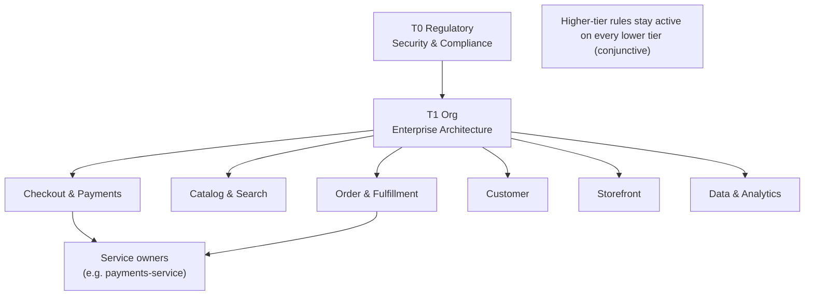
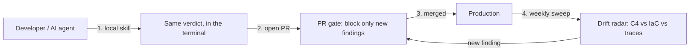

# NorthPeak Retail — How ArchGuard Works End to End

A concrete walkthrough of one enterprise adopting ArchGuard: who uses it, in which moment, and the
benefit each moment produces. NorthPeak Retail is an illustrative company; the flows, rules, and
teams mirror the design in [archguard-design.md](archguard-design.md). All figures are illustrative
scenario numbers to show shape and magnitude — not measured results.

---

## 1. The company and the pain

NorthPeak Retail is an omnichannel retailer: web, mobile, physical stores, and fulfillment, running
~180 services across ~40 teams on AWS, polyglot (Java, Kotlin, TypeScript, a little Go). Peak is
Black Friday and Cyber Monday, when checkout runs ~20x baseline and any new coupling into the
checkout path becomes an existential risk.

Before ArchGuard:

- Architecture is signed off at an ARB at project kickoff, then never re-checked against the code.
- Six enterprise architects review by hand and realistically see ~5% of pull requests.
- Two of last year's Sev1 incidents traced back to an undeclared **synchronous dependency in the
  checkout path**.
- New engineers take ~3 months to learn the unwritten boundaries.
- AI coding agents now open a growing share of PRs — faster than anyone can review them for
  architecture.

The gap is specific: **architecture intent exists on paper, but nothing checks each change against
it.**

---

## 2. Who uses the tool

| Tier | Team | Sub-teams | How they use ArchGuard |
|---|---|---|---|
| T0 Regulatory | Security & Compliance | AppSec, GRC, Privacy | Own PCI/trust-boundary rules; consume the exception register for audit |
| T1 Org | Enterprise Architecture | Platform standards, API governance | Author org rules; curate the catalog; watch org scorecards |
| T2 Domain | Checkout & Payments | Cart, Checkout, Payments, Fraud | Own the checkout-isolation rules; review team exceptions |
| T2 Domain | Catalog & Search | Product, Pricing, Search, Recommendations | Own price-store ownership and read-model rules |
| T2 Domain | Order & Fulfillment | Orders, Inventory, Warehouse, Shipping | Own stock-ownership rules; biggest Black-Friday exposure |
| T2 Domain | Customer | Profile, Identity, Loyalty, Notifications | Own token-issuer and event-consumption rules |
| T3 Team | Storefront | Web, Mobile BFF, CMS | Consume rules locally; fix findings before PR |
| T3 Team | Data & Analytics | Streaming, Warehouse, ML | Own "analytics stays out of the request path" rules |
| Leadership | CTO / VP Eng | — | Read scorecards: risk, debt burn-down, exception ages |



---

## 3. Day 0 — adoption (one to two weeks)

1. Create the governed inputs, each with `CODEOWNERS`:
   - `architecture/` — the C4/Structurizr model (imported from the existing diagrams).
   - `design/` — declared layers, ports, stereotypes, aggregates per service.
   - `governance/` — `fitness/`, `design-rules/`, `catalog/`, `exceptions/`, `compiled/`,
     `baseline/`.
2. Wire evidence providers: Structurizr parser, dependency-cruiser/ArchUnit, the Terraform plan.
3. Seed ~10 org catalog rules; three pilot teams add their own.
4. Turn the gate on in **advisory mode** and **baseline** every existing violation as recorded
   debt, so no team is punished for legacy code on day one.

**Benefit:** adoption is non-disruptive. Nothing is blocked yet; teams see findings and build
trust before anything turns red.

### First-time review — architecture-as-code, not a Word doc

When the Recommendations team spins up a new service, they do not write a 40-page design document.
They add a C4/Structurizr model and design declarations to the repo and onboard it into ArchGuard.
Within minutes they get their **first architecture review automatically**: inherited org and domain
rules replayed against the new model and code, with passes, failures, `UNKNOWN`s, and recorded
debt. A domain architect then reviews those findings, discusses the real trade-offs, approves the
baseline, and logs any accepted deviations as time-boxed exceptions. From then on the same review
runs continuously on every PR.

**Benefit:** the upfront ARB document is replaced by a living, executable model; the first review
is fast and evidence-based; and the architect stays in the loop for judgement, not mechanical
checks.

---

## 4. Authoring a rule (Enterprise Architecture)

An architect writes, in plain English:

> "No service may share another domain's database; cross-domain access must go through a published
> API or event."

The authoring agent restates it, compiles it to a predicate, and generates pass/fail fixtures, then
opens a **policy pull request**:

```yaml
id: ARC-DEP-002
title: No cross-domain database access
tier: org
owner: enterprise-architecture
scope: ["*"]
type: structural
severity: high
mode: blocking
evidence: architecture-model
review_by: 2027-03-31
body: >
  No service may share another domain's database. All cross-domain access must go
  through a published API or a domain event.
```

The architect reviews the six-line predicate and its two fixtures as a diff, approves, and merges.
The rule is now **versioned and pinned**. The Payments team layers a stricter team rule on top
(`PAY-014`: checkout must not synchronously call Customer Profile).

**Benefit:** the rule is written once, reviewed once, and now enforced identically everywhere — no
per-PR reinterpretation.

---

## 5. A developer's day — local pre-flight (Copilot CLI skill)

Maria on the Orders team is adding a stock check and is about to read the Inventory database
directly. Before pushing, she runs the skill, which **fetches the approved rules from the
governance repo** and replays them on her working tree:

```
$ copilot -p "archguard: can orders read the inventory database directly?"
FAIL  ARC-DEP-002 (org, blocking) — no cross-domain database access
  path: orders-service -> inventory-db
  fix:  reserve stock via the Inventory API (event-backed projection)
```

She switches to the Inventory API in 20 minutes — instead of getting a review rejection two days
later and reworking finished code.

**Benefit:** architecture feedback in seconds, no rework cycle, no architect pulled in. This is the
developer self-service gap closed.

---

## 6. An AI coding agent opens a PR (the closed loop)

An AI coding agent implements a promotions feature and opens a PR; an AI reviewer approves it. The
deterministic ArchGuard gate still runs and catches that the agent introduced a **synchronous call
from Checkout to Customer Profile** — a `PAY-014` violation. The PR is blocked with the Payments
team's own sentence quoted back and the event-projection fix attached.

**Benefit:** when both author and reviewer are AI, ArchGuard is the **independent, reproducible
control** that a model cannot rationalize away — so AI-raised PRs are held to the same architecture
as human ones.

---

## 7. Black Friday near-miss

Two weeks before peak, a rushed PR adds a direct `Orders -> Inventory DB` read to shave latency, and
skips the local skill. The PR gate blocks it on `ARC-DEP-002` and shows the blast radius: with that
edge, an Inventory slowdown would stop order placement during peak.

**Benefit:** an outage that would have cost NorthPeak its per-hour checkout revenue is prevented at
review time, for the price of a one-line change — the cheapest possible place to catch it.

---

## 8. Continuous drift radar

A weekly sweep compares three views of the architecture:

- **Designed** — the C4 model.
- **Built/planned** — the Terraform plan.
- **Observed** — OpenTelemetry traces.

It surfaces a config-driven runtime dependency the static model never showed:

> Diagram says async; production shows 4,102 synchronous calls from `checkout` to `profile` in the
> last hour.

**Benefit:** drift is caught in a week by a report, not months later by an incident.



---

## 9. Exceptions — pragmatic, not permanent

During a migration, the Loyalty team genuinely needs a temporary direct read. They file a
**time-boxed, ADR-backed exception**: scope limited to two services, expires in 60 days, approved by
the domain architect. The gate goes green for that scope; when the exception expires, the finding
automatically reappears until renewed or resolved.

**Benefit:** teams stay unblocked for legitimate reasons, and no shortcut silently becomes permanent
architecture debt.

---

## 10. Leadership view

The CTO's quarterly scorecard shows: high-severity violations blocked before merge, architecture
debt burning down per team, exception counts and ages, recurring-rule hotspots, and the fall in
manual ARB reviews.

**Benefit:** architecture risk becomes a measured, governed number instead of tribal anxiety.

---

## 11. Benefits realized (illustrative)

| Dimension | Before ArchGuard | After (illustrative) |
|---|---|---|
| PRs reviewed for architecture | ~5% (manual) | ~100% (automated, every PR) |
| Time to architecture feedback | days | seconds locally, minutes on the PR |
| Architect time | bottleneck on routine review | shifted to curating rules and exceptions |
| Checkout-path coupling incidents | 2 Sev1 last year | 0 in the scenario period |
| Onboarding to "knows the boundaries" | ~3 months | ~2 weeks (rules explicit + local skill) |
| AI-raised PRs checked for architecture | 0% | 100%, deterministically |
| Exceptions | untracked, effectively permanent | tracked, owned, self-expiring |
| Drift discovery | at the next incident | weekly report |

**Money and customers:** a single prevented Black-Friday checkout outage can exceed the entire cost
of adopting the tool; every violation caught at the PR instead of in production avoids a later
multi-team migration and protects checkout revenue and customer trust at peak.

---

## 12. Why it works, in one line

Rules are authored once in English, compiled and reviewed, then **replayed deterministically
everywhere** — local pre-flight, the PR gate, and the drift sweep — so every change, human or AI, is
checked against the same architecture, in the team's own words, with the same verdict every time.
