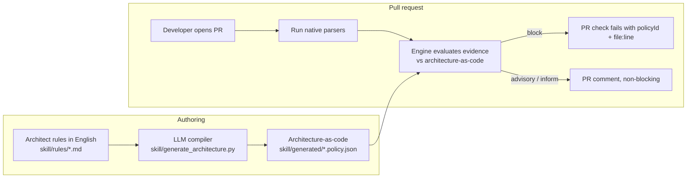

# Pipeline — continuous architecture review on every PR

This folder owns **how the architecture-as-code rules are triggered from CI**. The goal
is architecture review at *every step*, not once: when a pull request opens, the pipeline
runs the parsers, hands their evidence to the engine, and blocks only on high-confidence
declared-vs-implemented drift.

## The flow



## Parsers that produce evidence

The engine never invents facts. It consumes JSON from native parsers:

```sh
structurizr-cli export -workspace workspace.dsl -format json -output build
dependency-cruiser --output-type json src > build/dependencies.json
terraform show -json plan.tfplan > build/terraform-plan.json
```

## Calling the rules from the pipeline

```sh
python -m archguard.cli \
  --structurizr build/workspace.json \
  --dependency-cruiser build/dependencies.json \
  --terraform-plan build/terraform-plan.json \
  --changed-file src/payments/client.ts
```

The command writes `archguard-results.json` and exits non-zero **only** for blocking
findings, so it can gate a PR directly. A ready-to-copy workflow lives in
[`workflows/archguard.yml`](./workflows/archguard.yml).

## Owner

This folder is owned by the **Pipeline** contributor. See
[`../CONTRIBUTING.md`](../CONTRIBUTING.md).
