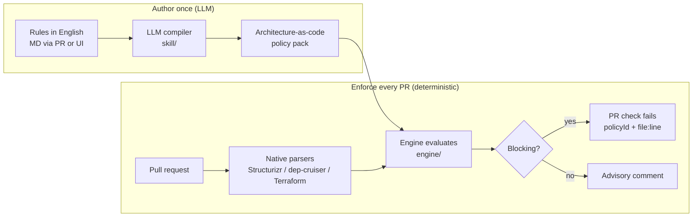
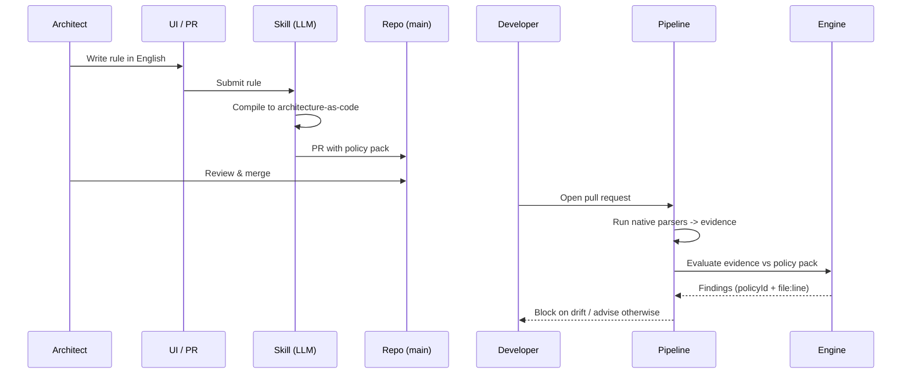
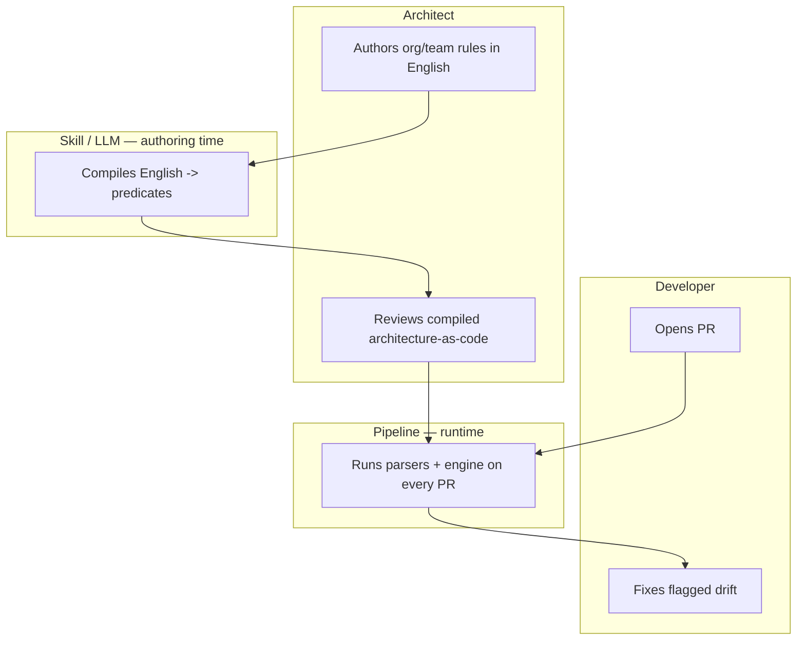

# ArchGuard-AI

### Continuous architecture review at every step — not once

Architecture governance that runs on **every pull request**, deterministically.

_Internal hackathon pitch_

---

## The problem

Architecture review today is a **point-in-time event, not a continuous practice**:

- **Reviewed once, then it drifts.** Signed off at kickoff, maybe revisited at an ARB
  every ~6 months. Code drifts in between and nobody notices until it's expensive.
- **Rules are hard to enforce because they're hard to update.** They live in wikis,
  slides, and senior engineers' heads — so they go stale and get ignored.
- **Developers can't follow what they can't see.** Guidance is verbal and tribal, never
  expressed as **architecture-as-code**, so there's no check on the PR.

> Architecture intent is never turned into an executable, always-on check that runs
> where developers work — the pull request.


---

## The idea

1. Architects write rules in **plain English** (org / domain / team / service, HLD + LLD)
   — via a Markdown PR or the UI.
2. An **LLM compiles** each rule into **architecture-as-code** — once, at authoring time.
3. The **pipeline** runs the compiled rules **deterministically** on every PR.
4. Findings carry a **policy ID + `file:line`**. High-confidence drift **blocks**.

> The model proposes at authoring time. The compiled rule decides at runtime.

---

## Flow diagram



---

## Sequence diagram



---

## Role diagram



---

## What "architecture-as-code" looks like

English rule:
> "Modules in `payments` must not call `legacy-billing` synchronously."

Compiled policy (deterministic, reviewed in a PR):

```json
{
  "policyId": "ARC-COM-003",
  "scope": "domain:payments",
  "tier": "lld",
  "severity": "block",
  "predicate": "require_async_cross_context(target='legacy-billing')",
  "source": "rules/payments.md#rule-1"
}
```

---

## Repo is built for parallel work

| Area | Folder | Owner |
| --- | --- | --- |
| Skill / Authoring (LLM) | `skill/` | _name_ |
| Engine (deterministic) | `engine/` | _name_ |
| Pipeline (CI trigger) | `pipeline/` | _name_ |
| UI (author + review) | `ui/` | _name_ |
| Pitch | `pitch/` | _name_ |

Four independent workstreams, one JSON contract between them.

---

## Why it wins

- **Deterministic gate** — reproducible, auditable, unlike generic AI reviewers.
- **Evidence-bound** — every finding has a policy ID and `file:line`.
- **Author once, enforce always** — LLM effort is spent at authoring, not per PR.
- **Continuous** — architecture review at every step, seamless for developers.

---

## The ask

- Pick your area and grab it in `CODEOWNERS`.
- Demo goal: English rule → compiled policy → blocked PR, end to end.
- Stretch: live UI authoring + advisory comments on a real PR.

**Let's ship continuous architecture review.**
