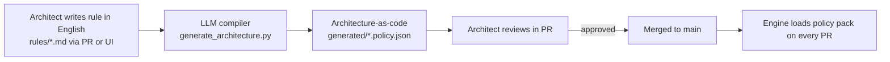

# ArchGuard Authoring Skill

## What this skill does

An architect writes a rule in plain English, for example:

> "Services in the `payments` domain must never call the `legacy-billing` context
> synchronously. Cross-context communication must be asynchronous (events)."

This skill compiles that sentence into an **architecture-as-code** predicate that the
[engine](../engine/) evaluates deterministically. The compiled rule carries a stable
policy ID, a scope (org / domain / team / service), a tier (HLD or LLD), and the exact
predicate — no natural language survives into runtime.

## Why LLM only at authoring time

- **Authoring (LLM):** ambiguity resolution, mapping English → predicate, suggesting
  scope and severity. Reviewed by the architect in a PR before it lands.
- **Runtime (no LLM):** the engine loads the compiled predicates and checks parser-derived
  facts. The gate decision is deterministic and reproducible.

This is the core guarantee: **the model proposes, the compiled rule decides.**

## Inputs

1. A natural-language rule file under [`rules/`](./rules/) (authored via PR or the UI).
2. Optional context: existing architecture graph facts (Structurizr export) so the
   compiler can bind English names to real HLD nodes.

## Output

A compiled policy in [`generated/`](./generated/) — a JSON policy pack consumed by the
engine. Each entry has:

```jsonc
{
  "policyId": "ARC-DEP-002",
  "scope": "domain:payments",
  "tier": "lld",
  "severity": "block",
  "predicate": "no_cross_context_sync(source='payments', target='legacy-billing')",
  "source": "rules/payments.md#L4",
  "rationale": "Decouple payments from legacy billing; enforce event-driven integration."
}
```

## How to run

```sh
python skill/generate_architecture.py \
  --rules skill/rules/payments.md \
  --structurizr build/workspace.json \
  --out skill/generated/payments.policy.json
```

Set `ARCHGUARD_LLM=1` and provide `OPENAI_API_KEY` (or your provider's key) to use a
live model. Without it, the script runs a deterministic offline compiler so the
hackathon demo works with no network.

## Authoring loop



## Owner

This folder is owned by the **Skill / Authoring** contributor. See
[`../CONTRIBUTING.md`](../CONTRIBUTING.md).
